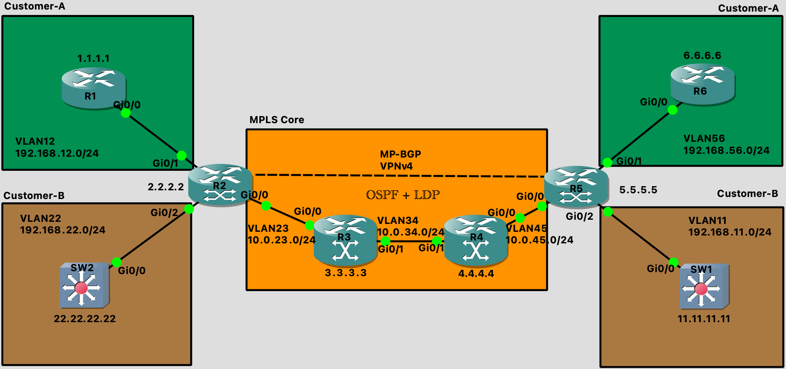

Configuring a Label Switched Network
====================================

Lab Setup
---------

:download:`_files/configure-a-label-switched-network.zip`

**SW1**

.. code-block::

  SW1(config)#int lo1
  SW1(config-if)#ip add 11.11.11.11 255.255.255.0
  SW1(config-if)#no shut
  SW1(config-if)#vlan 11
  SW1(config-vlan)#name VLAN11
  SW1(config)#int g0/0
  SW1(config-if)#no switchport
  SW1(config)#int g0/0.11
  SW1(config-subif)#encap dot1q 11
  SW1(config-subif)#ip add 192.168.11.2 255.255.255.0

**SW2**

.. code-block::

  SW2(config)#int lo1
  SW2(config-if)#ip add 22.22.22.22 255.255.255.0
  SW2(config-if)#no shut
  SW2(config-if)#vlan 22
  SW2(config-vlan)#name VLAN22
  SW2(config-if)#int g0/0
  SW2(config-if)#no switchport
  SW2(config-if)#int g0/0.22
  SW2(config-subif)#encap dot1q 22
  SW2(config-subif)#ip add 192.168.22.2 255.255.255.0

**R1**

.. code-block::

  R1(config)#int lo1
  R1(config-if)#ip add 1.1.1.1 255.255.255.0
  R1(config-if)#vlan 12
  R1(config-vlan)#name VLAN12
  R1(config)#int g0/0
  R1(config-if)#no switchport
  R1(config-if)#int g0/0.12
  R1(config-subif)#encap dot1q 12
  R1(config-subif)#ip add 192.168.12.2 255.255.255.0

**R2**

.. code-block::

  R2(config)#int lo1
  R2(config-if)#ip add 2.2.2.2 255.255.255.0
  R2(config-if)#no shut
  R2(config-if)#vlan 22
  R2(config-vlan)#name VLAN22
  R2(config)#vlan 12
  R2(config-vlan)#name VLAN12
  R2(config-if)#vlan 23
  R2(config-vlan)#name VLAN23
  R2(config)#int r g0/0 - 2
  R2(config-if-range)#no switchport
  R2(config-subif)#encap dot1q 23
  R2(config-subif)#ip add 10.0.23.1 255.255.255.0
  R2(config-subif)#int g0/1.12
  R2(config-subif)#encap dot1q 12
  R2(config-subif)#ip add 10.0.12.1 255.255.255.0
  R2(config-subif)#int g0/2.22
  R2(config-subif)#encap dot1q 22
  R2(config-subif)#ip add 192.168.22.1 255.255.255.0

**R3**

.. code-block::

  R3(config)#int lo1
  R3(config-if)#ip add 3.3.3.3 255.255.255.0
  R3(config-if)#no shut
  R3(config-if)#vlan 23
  R3(config-vlan)#name VLAN23
  R3(config)#vlan 34
  R3(config-vlan)#name VLAN34
  R3(config)#int r g0/0 -1
  R3(config-if-range)#no switchport
  R3(config-if-range)#int g0/0.23
  R3(config-subif)#encap dot1q 23
  R3(config-subif)#ip add 10.0.23.2 255.255.255.0
  R3(config-subif)#int g0/1.34
  R3(config-subif)#encap dot1q 34
  R3(config-subif)#ip add 10.0.34.1 255.255.255.0

**R4**

.. code-block::

  R4(config)#int lo1
  R4(config-if)#ip add 4.4.4.4 255.255.255.0
  R4(config-if)#no shut
  R4(config-if)#vlan 34
  R4(config-vlan)#name VLAN34
  R4(config-if)#vlan 45
  R4(config-vlan)#name VLAN45
  R4(config-if)#int r g0/0 -1
  R4(config-if-range)#no switchport
  R4(config-if-range)#int g0/0.45
  R4(config-subif)#encap dot1q 45
  R4(config-subif)#ip add 10.0.45.1 255.255.255.0
  R4(config-subif)#int g0/1.34
  R4(config-subif)#encap dot1q 34
  R4(config-subif)#ip add  10.0.34.2 255.255.255.0

**R5**

.. code-block::

  R5(config)#int lo1
  R5(config-if)#ip add 5.5.5.5 255.255.255.0
  R5(config-if)#no shut
  R5(config-if)#vlan 45
  R5(config-vlan)#name VLAN45
  R5(config-if)#vlan 56
  R5(config-vlan)#name VLAN56
  R5(config-if)#vlan 11
  R5(config-vlan)#name VLAN11
  R5(config)#int r g0/0 - 2
  R5(config-if-range)#no switchport
  R5(config)#int g0/0.45
  R5(config-subif)#encap dot1q 45
  R5(config-subif)#ip add 10.0.45.2 255.255.255.0
  R5(config-subif)#int g0/1.56
  R5(config-subif)#encap dot1q 56
  R5(config-subif)#ip add 192.168.56.1 255.255.255.0
  R5(config-subif)#int g0/2.11
  R5(config-subif)#encap dot1q 11
  R5(config-subif)#ip add 192.168.11.1 255.255.255.0

**R6**

.. code-block::

  R6(config)#int lo1
  R6(config-if)#ip add 6.6.6.6 255.255.255.0
  R6(config-if)#no shut
  R6(config-if)#vlan 56
  R6(config-vlan)#name VLAN56
  R6(config)#int g0/0
  R6(config-if)#no switchport
  R6(config-if)#int g0/0.56
  R6(config-subif)#encap dot1q 56
  R6(config-subif)#ip add 192.168.56.2 255.255.255.0

Configuring OSPF
----------------

**R2**

.. code-block::

  R2(config)#int g0/0.23
  R2(config-subif)#ip ospf network point-to-point
  R2(config-subif)#router ospf 1
  R2(config-router)#router-id 2.2.2.2
  R2(config-router)#passive-interface default
  R2(config-router)#no passive-interface g0/0.23
  R2(config-router)#network 2.2.2.2 0.0.0.255 area 0
  R2(config-router)#network 10.0.23.0 0.0.0.255 area 0

**R3**

.. code-block::

  R3(config)#int g0/0.23
  R3(config-subif)#ip ospf network point-to-point
  R3(config-subif)#int g0/1.34
  R3(config-subif)#ip ospf network point-to-point
  R3(config-subif)#router ospf 1
  R3(config-router)#router-id 3.3.3.3
  R3(config-router)#passive-interface default
  R3(config-router)#no passive-interface g0/0.23
  R3(config-router)#no passive-interface g0/1.34
  R3(config-router)#network 3.3.3.3 0.0.0.255 area 0
  R3(config-router)#network 10.0.23.0 0.0.0.255 area 0
  R3(config-router)#network 10.0.34.0 0.0.0.255 area 0

**R4**

.. code-block::

  R4(config)#int g0/1.34
  R4(config-subif)#ip ospf network point-to-point
  R4(config)#int g0/0.45
  R4(config-subif)#ip ospf network point-to-point
  R4(config-subif)#router ospf 1
  R4(config-router)#router-id 4.4.4.4
  R4(config-router)#passive-interface default
  R4(config-router)#no passive-interface g0/1.34
  R4(config-router)#no passive-interface g0/0.45
  R4(config-router)#network 4.4.4.4 0.0.0.255 area 0
  R4(config-router)#network 10.0.34.0 0.0.0.255 area 0
  R4(config-router)#network 10.0.45.0 0.0.0.255 area 0

**R5**

.. code-block::

  R5(config)#int g0/0.45
  R5(config-subif)#ip ospf network point-to-point
  R5(config-subif)#router ospf 1
  R5(config-router)#router-id 5.5.5.5
  R5(config-router)#passive-interface default
  R5(config-router)#no passive-interface g0/0.45
  R5(config-router)#network 5.5.5.5 0.0.0.255 area 0
  R5(config-router)#network 10.0.45.0 0.0.0.255 area 0

Configuring MPLS
----------------

**R2**

.. code-block::

  R2(config)#mpls ip
  R2(config)#mpls ldp router-id lo1
  R2(config)#mpls label protocol ldp
  R2(config)#mpls label range 200 299
  R2(config)#int g0/0.23
  R2(config-subif)#mpls ip
  R2(config-subif)#end

**R3**

.. code-block::

  R3(config)#mpls ip
  R3(config)#mpls ldp router-id lo1
  R3(config)#mpls label protocol ldp
  R3(config)#mpls label range 300 399
  R3(config)#int g0/0.23
  R3(config-subif)#mpls ip
  R3(config-subif)#int g0/1.34
  R3(config-subif)#mpls ip

**R4**

.. code-block::

  R4(config)#mpls ip
  R4(config)#mpls ldp router-id lo1
  R4(config)#mpls label protocol ldp
  R4(config)#mpls label range 400 499
  R4(config)#int g0/1.34
  R4(config-subif)#mpls ip
  R4(config-subif)#int g0/
  R4(config-subif)#int g0/0.45
  R4(config-subif)#mpls ip

**R5**

.. code-block::

  R5(config)#mpls ip
  R5(config)#mpls ldp router-id lo1
  R5(config)#mpls label protocol ldp
  R5(config)#mpls label protocol ldp
  R5(config)#mpls label range 500 599
  R5(config)#int g0/0.45
  R5(config-subif)#mpls ip

Verifying MPLS Forwarding
-------------------------

**Show the RIB**

.. code-block::

  R4#sh ip route
  Codes: L - local, C - connected, S - static, R - RIP, M - mobile, B - BGP
         D - EIGRP, EX - EIGRP external, O - OSPF, IA - OSPF inter area
         N1 - OSPF NSSA external type 1, N2 - OSPF NSSA external type 2
         E1 - OSPF external type 1, E2 - OSPF external type 2
         i - IS-IS, su - IS-IS summary, L1 - IS-IS level-1, L2 - IS-IS level-2
         ia - IS-IS inter area, * - candidate default, U - per-user static route
         o - ODR, P - periodic downloaded static route, H - NHRP, l - LISP
         a - application route
         + - replicated route, % - next hop override

  Gateway of last resort is not set

        2.0.0.0/32 is subnetted, 1 subnets
  O        2.2.2.2 [110/3] via 10.0.34.1, 00:33:53, GigabitEthernet0/1.34
        3.0.0.0/32 is subnetted, 1 subnets
  O        3.3.3.3 [110/2] via 10.0.34.1, 00:33:53, GigabitEthernet0/1.34
        4.0.0.0/8 is variably subnetted, 2 subnets, 2 masks
  C        4.4.4.0/24 is directly connected, Loopback1
  L        4.4.4.4/32 is directly connected, Loopback1
        5.0.0.0/32 is subnetted, 1 subnets
  O        5.5.5.5 [110/2] via 10.0.45.2, 00:30:31, GigabitEthernet0/0.45
        10.0.0.0/8 is variably subnetted, 5 subnets, 2 masks
  O        10.0.23.0/24 [110/2] via 10.0.34.1, 00:33:53, GigabitEthernet0/1.34
  C        10.0.34.0/24 is directly connected, GigabitEthernet0/1.34
  L        10.0.34.2/32 is directly connected, GigabitEthernet0/1.34
  C        10.0.45.0/24 is directly connected, GigabitEthernet0/0.45
  L        10.0.45.1/32 is directly connected, GigabitEthernet0/0.45

**Show the LIB**

.. code-block::

  R2#sh mpls ldp bindings
    lib entry: 2.2.2.0/24, rev 2
    local binding:  label: imp-null
    lib entry: 3.3.3.3/32, rev 4
    local binding:  label: 200
    lib entry: 4.4.4.4/32, rev 6
    local binding:  label: 201
    lib entry: 10.0.12.0/24, rev 8
    local binding:  label: imp-null
    lib entry: 10.0.23.0/24, rev 10
    local binding:  label: imp-null
    lib entry: 10.0.34.0/24, rev 12
    local binding:  label: 202
    lib entry: 10.0.45.0/24, rev 14
    local binding:  label: 203
    lib entry: 192.168.12.0/24, rev 16
    local binding:  label: imp-null
    lib entry: 192.168.22.0/24, rev 18
    local binding:  label: imp-null

**Show the FIB**

.. code-block::

  R2#sh ip cef
  Prefix               Next Hop             Interface
  0.0.0.0/0            no route
  0.0.0.0/8            drop
  0.0.0.0/32           receive
  2.2.2.0/24           attached             Loopback1
  2.2.2.0/32           receive              Loopback1
  2.2.2.2/32           receive              Loopback1
  2.2.2.255/32         receive              Loopback1
  3.3.3.3/32           10.0.23.2            GigabitEthernet0/0.23
  4.4.4.4/32           10.0.23.2            GigabitEthernet0/0.23
  5.5.5.5/32           10.0.23.2            GigabitEthernet0/0.23
  10.0.12.0/24         attached             GigabitEthernet0/1.12
  10.0.12.0/32         receive              GigabitEthernet0/1.12
  10.0.12.1/32         receive              GigabitEthernet0/1.12
  10.0.12.255/32       receive              GigabitEthernet0/1.12
  10.0.23.0/24         attached             GigabitEthernet0/0.23
  10.0.23.0/32         receive              GigabitEthernet0/0.23
  10.0.23.1/32         receive              GigabitEthernet0/0.23
  10.0.23.2/32         attached             GigabitEthernet0/0.23
  10.0.23.255/32       receive              GigabitEthernet0/0.23
  10.0.34.0/24         10.0.23.2            GigabitEthernet0/0.23
  10.0.45.0/24         10.0.23.2            GigabitEthernet0/0.23
  Prefix               Next Hop             Interface
  127.0.0.0/8          drop
  192.168.12.0/24      attached             GigabitEthernet0/0.12
  192.168.12.0/32      receive              GigabitEthernet0/0.12
  192.168.12.2/32      receive              GigabitEthernet0/0.12
  192.168.12.255/32    receive              GigabitEthernet0/0.12
  192.168.22.0/24      attached             GigabitEthernet0/2.22
  192.168.22.0/32      receive              GigabitEthernet0/2.22
  192.168.22.1/32      receive              GigabitEthernet0/2.22
  192.168.22.255/32    receive              GigabitEthernet0/2.22
  224.0.0.0/4          drop
  224.0.0.0/24         receive
  240.0.0.0/4          drop
  255.255.255.255/32   receive

**Show the LFIB**

.. code-block::

  R4#sh mpls forwarding-table
  Local      Outgoing   Prefix           Bytes Label   Outgoing   Next Hop
  Label      Label      or Tunnel Id     Switched      interface
  400        No Label   3.3.3.3/32       0             Gi0/1.34   10.0.34.1
  401        300        2.2.2.2/32       0             Gi0/1.34   10.0.34.1
  402        Pop Label  10.0.23.0/24     590           Gi0/1.34   10.0.34.1
  403        No Label   5.5.5.5/32       0             Gi0/0.45   10.0.45.2

**Debug MPLS**

.. code-block::

  R2#ping 5.5.5.5 so lo1 repeat 1
  Type escape sequence to abort.
  Sending 1, 100-byte ICMP Echos to 5.5.5.5, timeout is 2 seconds:
  Packet sent with a source address of 2.2.2.2
  !
  Success rate is 100 percent (1/1), round-trip min/avg/max = 23/23/23 ms
  R3#debug mpls packet
  Feb 16 09:04:31.397: MPLS les: Gi0/0.23: rx: Len 122 Stack {303 0 255} - ipv4 data s:2.2.2.2 d:5.5.5.5 ttl:255 tos:0 prot:1
  Feb 16 09:04:31.397: MPLS les: Gi0/1.34: tx: Len 122 Stack {403 0 254} - ipv4 data s:2.2.2.2 d:5.5.5.5 ttl:255 tos:0 prot:1
  Feb 16 09:04:31.409: MPLS les: Gi0/1.34: rx: Len 122 Stack {300 0 254} - ipv4 data s:5.5.5.5 d:2.2.2.2 ttl:255 tos:0 prot:1
  R4#debug mpls packet
  Feb 16 09:19:05.258: MPLS les: Gi0/1.34: rx: Len 122 Stack {403 0 254} - ipv4 data s:2.2.2.2 d:5.5.5.5 ttl:255 tos:0 prot:1
  Feb 16 09:19:05.261: MPLS les: Gi0/0.45: rx: Len 122 Stack {401 0 255} - ipv4 data s:5.5.5.5 d:2.2.2.2 ttl:255 tos:0 prot:1
  Feb 16 09:19:05.261: MPLS les: Gi0/1.34: tx: Len 122 Stack {300 0 254} - ipv4 data s:5.5.5.5 d:2.2.2.2 ttl:255 tos:0 prot:1
