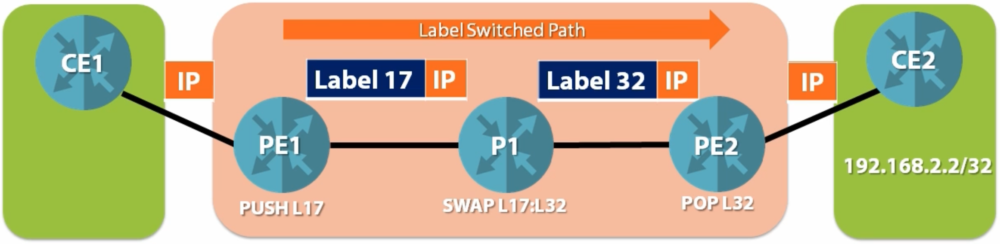
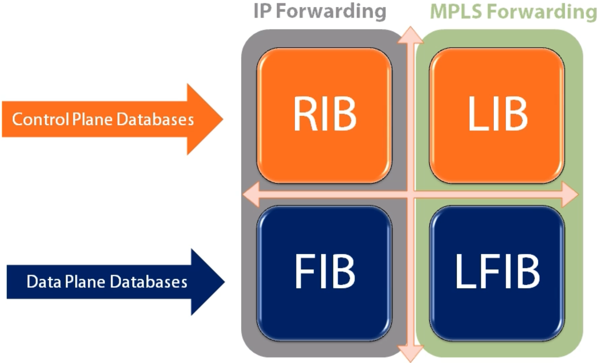
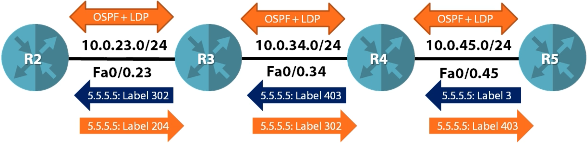
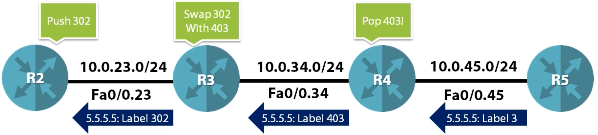
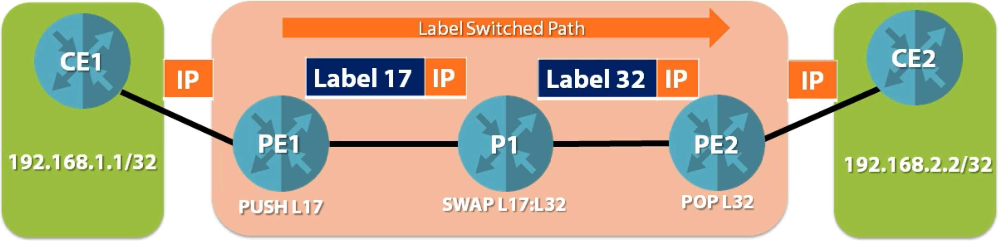

MPLS Fundamentals
=================

MPLS Data Plane
---------------

- LSR uses the **FIB** to forward **unlabeled IP packets**
- LSR uses the **LFIB** to forward **labeled packets**
- The FIB and LFIB databases are built by various control plane protocols

Key Router Databases
--------------------

- RIB (Routing Information Base) - ``sh ip route`` - Routing table, static, connected, etc.
- FIB (Forwarding Information Base) - ``sh ip cef`` works with CEF (Cisco Express Forwarding) adjacency table (prepackaged L2 info used for forwarding - MAC Address, DLCI), what do we do when we have a packet, what database do we look in, etc.
- LIB (Label Information Base) - ``sh mpls ldp bindings`` - Label Information Base (store anything to do with label)
- LFIB (Label Forward Information Base) - ``sh mpls forwarding-table`` - hardware based database, used to forward MPLS packets constructed by LIB, FIB & RIB

MPLS Control Plan
-----------------

- Step 1 - Every LSR generates a local label for every connected, static and IGP prefix
- Step 2 - Exchange prefix / label bindings with all LDP neighbors

- Once labels are exchanged, the MPLS data plane (LFIB can be constructed).
- Only the best prefix / label bindings from the LIB get put into LFIB
- The best path is still chosen by the IGP

Label Distribution Protocol (LDP)
---------------------------------

LDP Label Exchange
^^^^^^^^^^^^^^^^^^

LDP Mechanics
^^^^^^^^^^^^^

- LDP **hello messages** are **multicast** to **224.0.0.2** to discover LDP neighbors

  - **UDP** port **646**
  - Hello messages list the LDP **router-id**. This MUST be a valid IP address!

- **TCP** session is open between LDP routers to do **label exchange**

  - **TCP** port **646**
  - TCP session is between LDP router-id's - This is why they must be routable!
  - **Highest LDP RID** initiates TCP session

- LDP RID is chosen first by **configuration**, then **highest loopback**, then **highest interface** IP assigned

Penultimate Hop Popping
^^^^^^^^^^^^^^^^^^^^^^^

- LSR advertises a **special label** called **implicit null** (label value 3) for any prefixes that it needs to forward packets for using only (outside MPLS)
- The **implicit null** label tells the upstream neighbor to **pop** the outer most label before sending the packet as an efficiency mechanism

MPLS Ping and Traceroute
------------------------

MPLS Ping
^^^^^^^^^

- Classic ping works fine in MPLS environments but has some challenges

  - Classic ping only verifies that IP forwarding is working, but does not verify the LSP
  - If an end to end ping fails, it can be unclear where the exact problem is (could be many things - firewall, CE, MPLS could be broken but not pings, etc.)

- To solve these challenges, a special MPLS ping utility was developed

  - Can only be run on LSRs
  - Verifies an end to end LSP
  - IP packet that is carried across the LSP is constructed so it can NOT be routed

    - IP packet gets put inside LSP packet
    - TTL is 1
    - Destination is 127.0.0.0/8
    - Destination UDP is 3503 (reserved)
    - Rotuer alert is set in IP header
    - In MPLS header, TTL is set to 225
    - Lookup destination of ping, generate full label stack, and push label stack on packet
    - It won't fallback to routing, because the parameters (TTL, port, etc.) won't allow it to be routed

  - If the LSP is broken, an error message is returned to the source router

MPLS Classic Traceroute
^^^^^^^^^^^^^^^^^^^^^^^

- Traditional traceroute in an MPLS environment works differently than you might imagine
- It suffers from the same problems as ping and is not efficient

**Let's say CE1 is trying to trace to CE2:**

  - CE1 sends packet with TTL 1
  - PE1 gets packet and decrements TTL to 0, sends ICMP TTL expired to CE1
  - CE1 knows first hop is PE1
  - CE1 sends packet with TTL 2
  - PE1 gets packet and decrements TTL to 1, puts label 17 on the stack, and sends to P1
  - TTL on MPLS header is set to 1
  - P1 gets MPLS packet and decrements TTL to 0 in MPLS header
  - (now normally, in classic traceroute, P1 would send TTL expired to CE1, P1 doesn't know of IP realm and can't send it back to 192.168.1.1)
  - P1 generates ICMP TTL expired message and sends along LSP to PE2 (bizarre) sourced from its interface facing PE1 and the TTL expired message is destined to CE1, puts label 32 and sends to PE2
  - TTL expired gets sent to CE2, CE2 sends it back to PE2
  - CE1 eventually gets the TTL expired message
  - Same thing happens for 3rd hop, etc.

**Problems:**

- If LSP is broken, traceroute in MPLS might still work
- If we trace from one CE1 to CE2, no way to detect where LSP broke, ICMP responses travel along LSP first and break by the PE1 router
- MPLS traceroute utility was created and MPLS ping is used in the background and is run on LSR only
- A series MPLS (ping) echo packets are sent fully labelled checking the entire path
