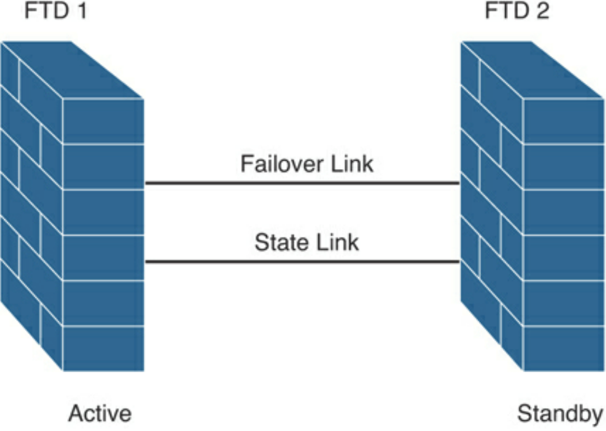
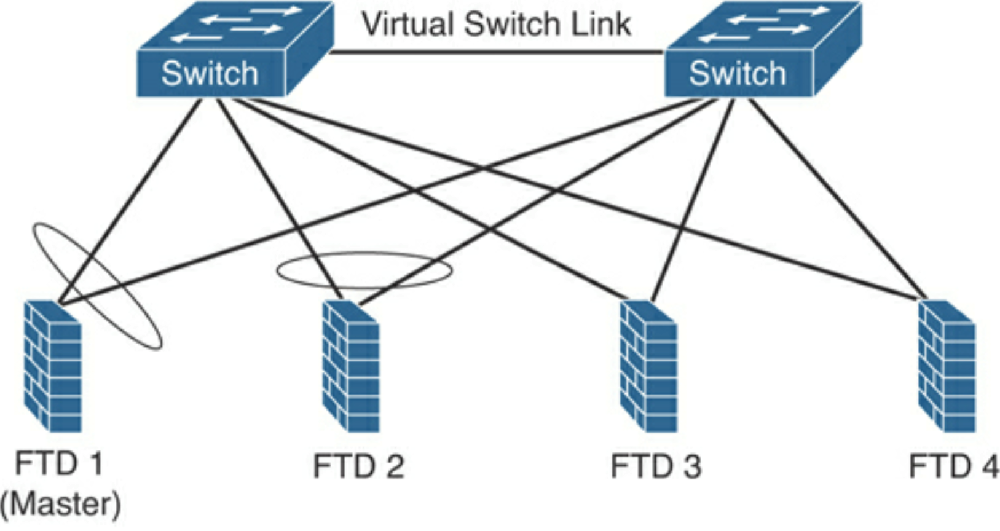
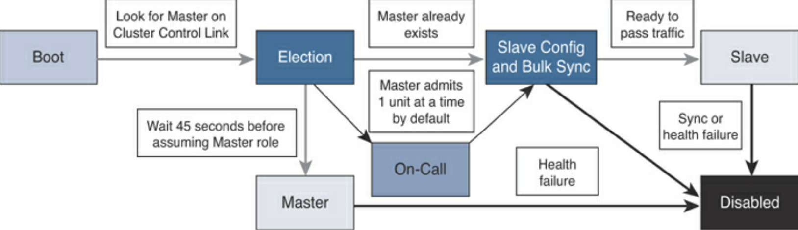

High Availability and Clustering
================================

* HA (failover) or cluster
* Identical FTD devices or identical ASA devices
* State link between devices
* ASA supports active-active & active-standby. FTD only supports active-standby
* Only active passes traffic
* Failover and stateful links are dedicated
* Stateful link is used to pass connection state information. Ensure that it the bandwidth available is equal on both sides. Latency must be less than 10ms, no more than 250ms.

Active-standby failover:

Communication over the failover link:

* The firewall state (active or standby)
* Hello messages (keepalives)
* Network link status
* MAC address exchange
* Configuration replication and synchronisation

Failover configuration requirements:

* The two participant devices must be configured in the same firewall mode (for example, routed or transparent).
* The two participant devices must be running the same software version.
* You can configure different Cisco FTD devices in groups (or domains) in the Cisco FMC. Devices configured for failover must be in the same domain or group on the Cisco FMC.
* The two participant devices must have the same Network Time Protocol (NTP) configuration (and time must be synchronized).
* Failover participant devices must be fully deployed with no uncommitted changes in the Cisco FMC.
* DHCP or PPPoE must not be configured on any of their interfaces.
* Same licenses - FMC releases any unnecessary licenses assigned to the standby device and replaces them with identical licenses assigned to the active and standby device.

Methods for connecting failover link:

* Use a switch with dedicated network segment (VLAN or broadcast domain).
* Direct connection between the two devices with the same ethernet speeds and ethernet numbers.

Clustering
----------

https://h4cker.org/scor/clustering.html

* Multiple FTDs into one, logical device.
* Supported only on 4100 & 9300.
* Increased throughput and redundancy.
* Cluster-control link (by default, port-channel 48) for unit-to-unit communication. Data and control traffic, state update and forwarded packets are sent over this link. Must be sized to handle comms of all members.
* Intra-chassis clustering can occur in 9300, using backplane for cluster comms.
* Inter-chassis clustering is achieved by allocating 1 or more physical interfaces in EtherChannel.
* Firepower chassis supervisor pushes minimal bootstrap config to each unit that has cluster name and control link interface settings when deploying cluster.
* FTD cluster assigns data interfaces to the cluster as spanned interfaces.
* FTD cluster members share policy and traffic flows.
* One FTD is the master unit (automatically determined), others are slaves. Master is either the first unit joining or on config'd priority.
* All config is done on master unit and replicated to slaves.
* New master is elected when master leaves cluster.
* Master handles all management and centralised functions.
* All members must be connected to single management network (separate to cluster control link). Management interfaces must be assigned when enabling clustering to be able to connect directly to member.

4 FTD devices connected to 2 switches:

FTD cluster unit state transition:

1. After the unit boots, it looks for a master over the cluster control link.
2. If there are no master units, it waits 45 seconds before assuming the master role. If a master already exists, it becomes a slave and the configuration is synchronized.
3. If there is a synchronisation or health issue, the unit is considered disabled in the cluster.
