Networking with Firewall Capabilities
=====================================

Comparing Network Security Solutions That Provide Firewall Capabilities
-----------------------------------------------------------------------

* Zone-Based Firewall (ZBFW) is a stateful firewall in Cisco IOS devices is the successor of the Context-Based Access Control (CBAC) IOS firewall.
* ZBFW Has features not available in CBAC, ie. assignment of router interfaces into different security zones to control traffic.
* ZBFW is cost effective, as it is integrated within a router device.
* ZBFW zones must be configured before interfaces can be assigned to the zone.
* ZBFW interfaces can only be assigned to one zone.
* ZBFW interfaces by default deny all traffic, except for traffic within same zone.
* ZBFW self-zone (traffic destined for the router itself) is by default allowed.
* ZBFW ACLs must be put in place to allow traffic.
* Pass, inspect, and drop actions are applied between zones.
* More info: https://github.com/The-Art-of-Hacking/h4cker/blob/master/SCOR/zbfw.md.

ZBFW can be implement in SD-WANs and the configuration and zone deployments include:

* Source zone: A group of VPNs where the data traffic flows originate. A VPN can be part of only one Source zone.
* Destination zone: A grouping of VPNs where the data traffic flows terminate. A VPN can be part of only one Destination zone.
* Firewall policy: A security policy, similar to a localised security policy, that defines the conditions that the data traffic flow from the source zone must match to allow the flow to continue to the destination zone. Firewall policies can match IP prefixes, IP ports, the protocols TCP, UDP, and ICMP, and applications. Matching flows for prefixes, ports, and protocols can be accepted or dropped, and the packet headers can be logged. Non-matching flows are dropped by default. Matching applications can only be denied.
* Zone pair: A container that associates a source zone with a destination zone and applies a firewall policy to the traffic that flows between the two zones.

Matching flows are accepted through:

* Inspect: The packet’s header can be inspected to determine its source address and port.
* Pass: The packet can pass to the destination zone without the packet’s header being inspected at all.

Deployment Modes of Network Security Solutions and Architectures That Provide Firewall Capabilities
---------------------------------------------------------------------------------------------------

* ASA protects internal network from external threats through untrusted interfaces, which are logically named (outside, inside, dmz).
* Security levels are applied, using ``nameif``, to ASA (0 - 100). The safest being 100 (inside) and the least safest being 0 (outside). A DMZ would have 50.
* The same security level can be applied to multiple interfaces (in the case of having 2 outside links for example). The ``same-security-traffic permit-interface`` global command must be inputted to allow as it says.
* An interface with no security level set will not participate in the network layer.
* IP Addresses are assigned to the interfaces (routed mode). Either through static or dynamic (DHCP client) configuration.

Routed vs. Transparent Firewalls
^^^^^^^^^^^^^^^^^^^^^^^^^^^^^^^^

* Usually firewalls are deployed in routed mode. ACLs separate the layer 3 networks through examining upper-layer headers and data payloads in packets.
* In transparent mode, the IP Address is assigned in global configuration mode on a bridge virtual interface (BVI).
* DHCP is not supported if in failover pair.
* Firewalls in routed mode cannot filter packets from one host to another in the same LAN segment. L3 firewalls require network segments to be created and are inserted into network, causing downtime.
* Transparent firewalls are Layer 2. They are placed between LAN and layer 3 device (router), without disrupting network.
* You can then filter unwanted traffic on layer 2. Below image shows 192.168.10.2 sending traffic to cisco.com and being allowed by firewall. Router does the translation, not the transparent firewall.

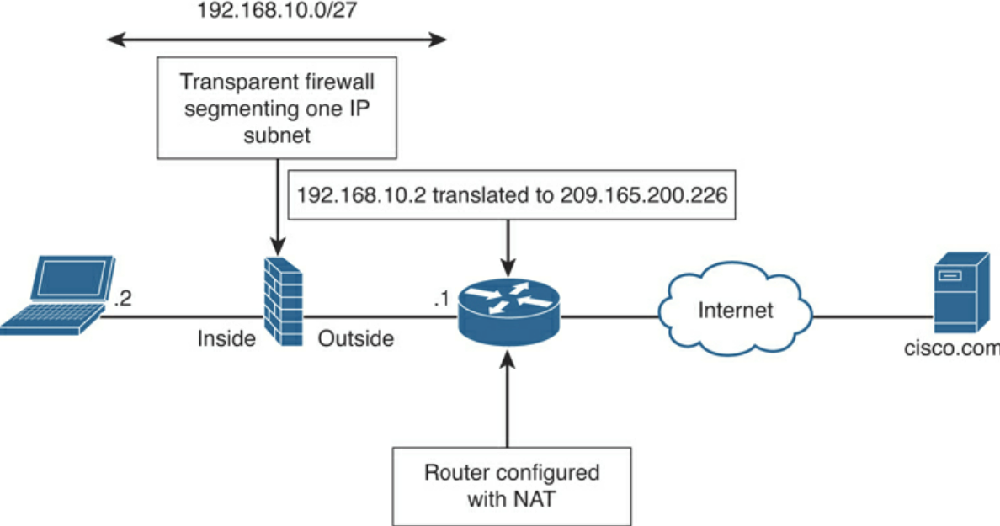

Security Contexts
^^^^^^^^^^^^^^^^^

Security Contexts enable physical firewalls to partition into multiple firewalls. Each firewall behaves as an independent firewall with its own config, interfaces, policies, routing, etc. A context can be either layer 2 (transparent) or layer 3 (routed). Some examples:

* You act as a service provider and you want to provide firewall services to customers; however, you do not want to purchase additional physical firewalls for each client.
* You manage an educational institution and you want to segregate student networks from faculty networks for improved security while using one physical security appliance.
* You administer a large enterprise with different departmental groups, and each department wants to implement its own security policies.
* You have overlapping networks in your organisation and you want to provide firewall services to all those networks without changing the addressing scheme.
* You currently manage many physical firewalls and you want to integrate security policies from all firewalls into one physical firewall.
* You manage a data centre environment and you want to provide end-to-end virtualisation to reduce operational costs and increase efficiency.

Single-Mode Transparent Firewalls
^^^^^^^^^^^^^^^^^^^^^^^^^^^^^^^^^

* A SMTF is a secure bridge that switches traffic from one interface to another.
* IP Address is assigned in global config, not per-interface IP. IP Address is used mainly for management access.
* Allows simple config - ACLs, inspection rules, NAT policies.

**The Admin Context:**

* SMTF is usually the admin context (similar to VM hypervisor), where you would only use this context for SNMP (of physical host), syslogs, file transfer, etc.
* The admin context is created first before other contexts by inputting the ``admin-context`` command.
* When ASA is converted from single to multiple mode, network config of single-mode is save in admin context. ASA names the context "admin".
* Admin context can be used as a regular context, but not recommended at all.

**The User Context:**

Customer / user contexts are virtual firewalls that support the following (examples) that are available in standalone firewall:

* IPS functionality
* Dynamic routing Packet filtering
* Network address translation (NAT)
* Site-to-site VPN
* IPv6 and device management

**Multiple-Context Mode:**

* Packets are classified and forwarded to correct context using a packet classifier, which identifies packets at the ingress interface.
* ASA designates packet-classifying criteria to identify the correct security context before forwarding packets (either shared interface or non-shared interface environment).
* Sharing of resources, such as physical interfaces occurs between contexts, one of the main benefits.
* ASA uses physical or logical sub-interfaces assigned to each context, which makes it easier for ASA to label packets based on source interface.
* ASA can share multiple interfaces between contexts and uses either destination IP or MAC address to classify packets to correct context.
* The MAC address on the interface(s) used by multiple context can the same, so classifier does not know which ingress packets received by ASA are for which context.
* Destination IP is used to identify destination context in above case. However, routing table might be the same on contexts, so ASA uses NAT table of each context to learn about subnets behind contexts.

**Multimode Transparent Firewall (MMTF):**

MMTFs perform the same way as single-mode, except:

* Packets are handled in different contexts. Because each context acts and behaves as an independent entity, you must configure an IP address to the bridge virtual interface (BVI) in each context for administration and management purposes.
* An interface cannot be shared between multiple contexts in this mode.

Cisco FTD Deployment Modes
^^^^^^^^^^^^^^^^^^^^^^^^^^

FTDs can also either be in routed or transparent mode.

FTD in routed mode:

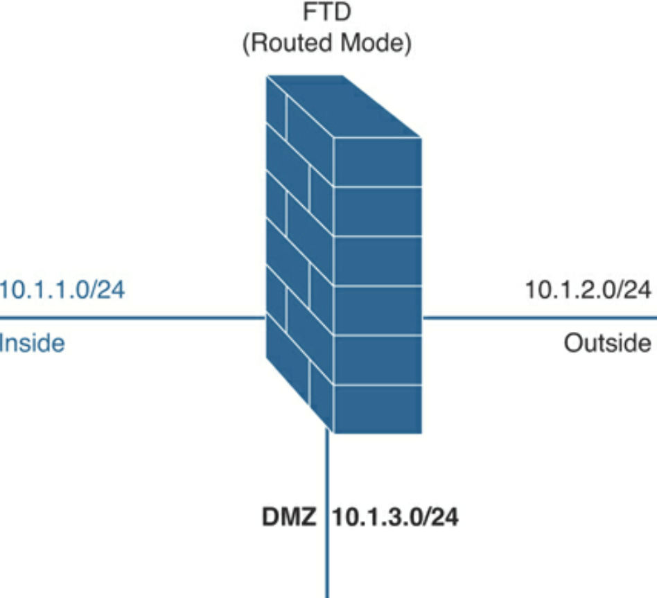

FTD in transparent mode:

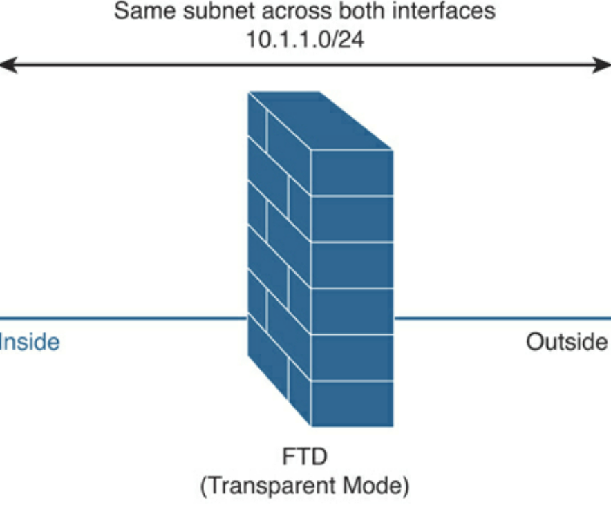

Cisco FTD Interface Modes
^^^^^^^^^^^^^^^^^^^^^^^^^

FTD can operate as NGFW and NGIPS in different interfaces:

* NGFW is operational mode of ASA and adds Firepower features.
* NGIPS acts as standalone Firepower with limited ASA data plane functions.

IPS-only passive interfaces, passive ERSPAN (routed mode only), and inline sets can be configured in FTD:

* IPS-only mode bypasses firewall checks and supports only IPS security policies. This is if you have a separate firewall and don't want extra overhead.
* Inline sets and passive interface are only supported on physical and EtherChannel interfaces and intra-chassis and inter-chassis clustering.
* Inline sets cannot use redundant or VLANs.
* Bidirectional Forwarding Detection (BFD) echo packets are not allowed through FTD when using inline sets.
* If there are two neighbours on either side of FTD running BFD, FTD will drop BFD echo packets, as source and destination IP address are identical.

FTD deployment modes:

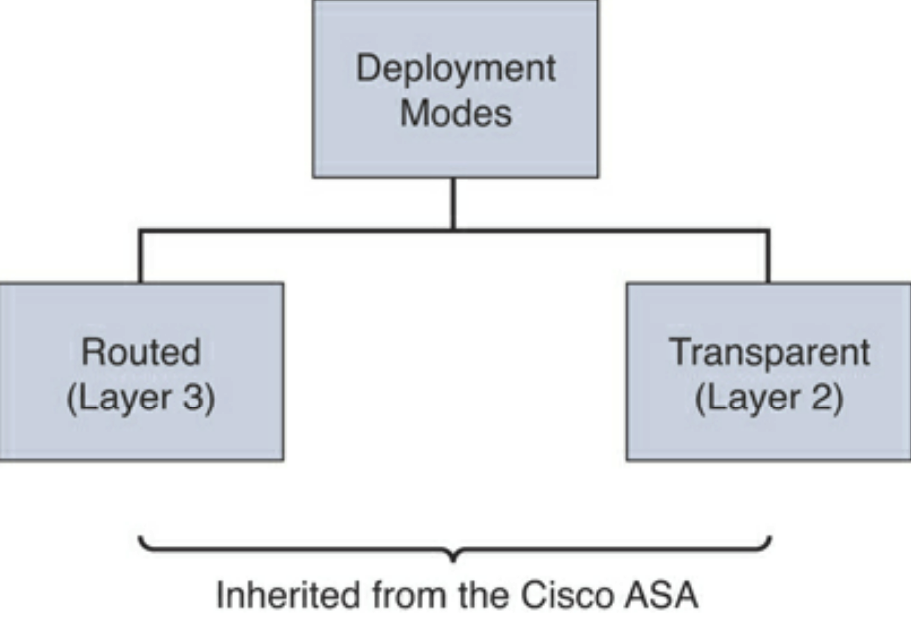

FTD interface modes:

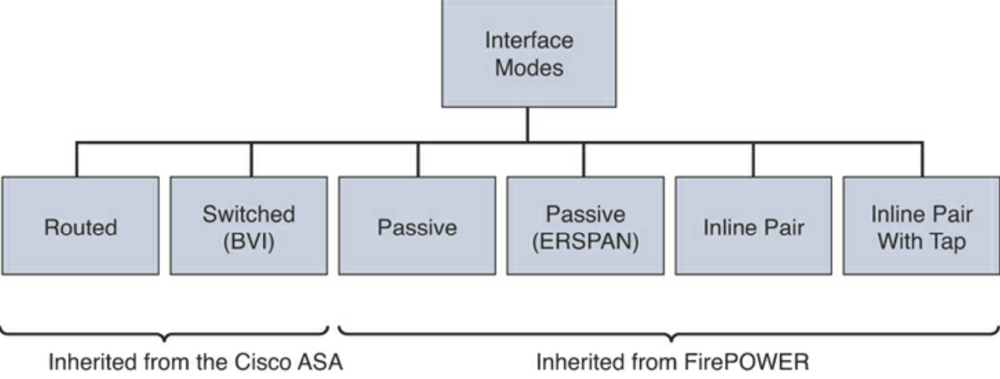

No additional routing required, as long as destination IP Address is in the same subnet as the BVI interface. FTD with intra-BVI communication:

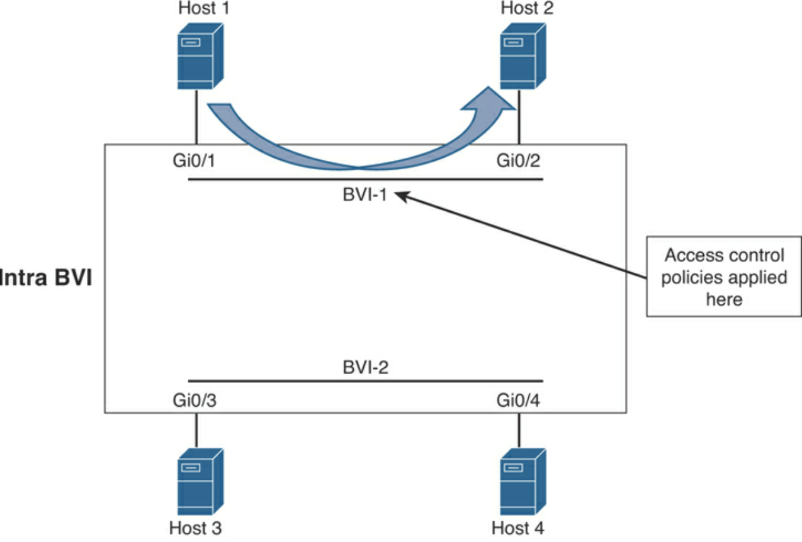

No additional routing required, as long as destination IP Address is in the directly connected subnet as the BVI interfaces. FTD with inter-BVI communication:

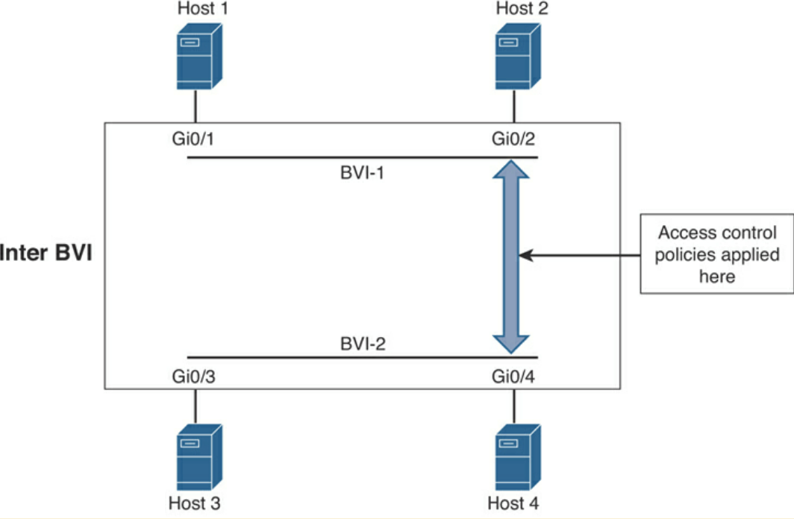

Traffic between a routed (L3) interface and a BVI:

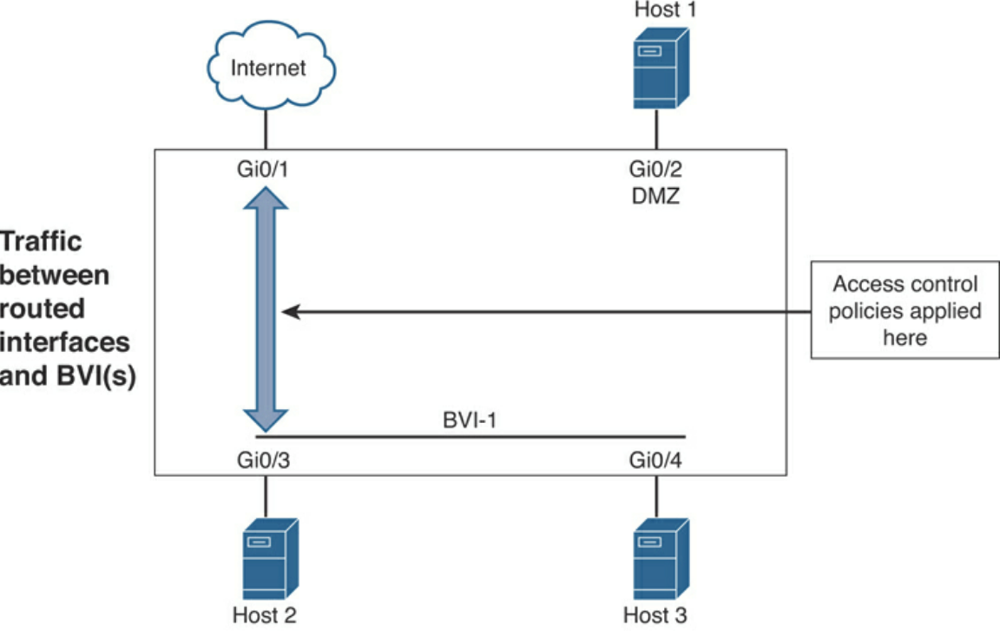

Inline Pair
^^^^^^^^^^^

* NGIPS can operate in either inline or passive (monitoring) modes.
* Inline is for prevention, placed between switch & router or switch & firewall to block/mitigate threats.
* Traffic can be dropped, allowed or reset.
* Two interfaces are used, one to enter and one to exit the device for inspection.
* All traffic is dropped if failure with inline device.
* Can operate in either transparent or routed modes.
* Legacy ASA features (NAT, routing. ACLs, etc.) aren't available for flows going through inline pair. Only few checks are available through Snort checks.
* One can configure FTD in inline NGIPS deployment or transparently on network segment by binding interfaces together.
* Unconditionally receive all traffic and retransmits out inline sets unless dropped.
* FTD categorises the inbound and outbound traffic as part of the same traffic flow when adding multiple inline interface pairs to the same inline interface set.
* FTD includes the same interface pairs in the same security zone when passive interfaces are configured (promiscuous mode).

Below depicts an FTD with 10 interfaces with 2 inline sets, 1 for 3 pairs of interfaces, other for 2 pairs of interfaces:

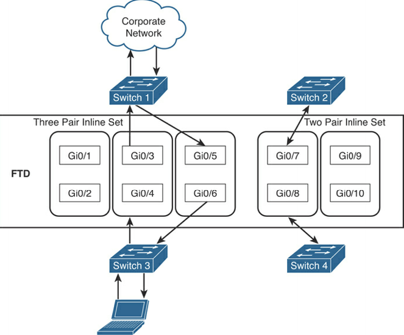

Inline Pair with Tap
^^^^^^^^^^^^^^^^^^^^

* Two physical interfaces internally bridged.
* Few firewall checks are applied with full snort checks with copy of traffic.
* Legacy ASA features (NAT, routing. ACLs, etc.) aren't available for flows going through inline pair.
* Can operate in either transparent or routed modes.

Example of inline pair with tap:

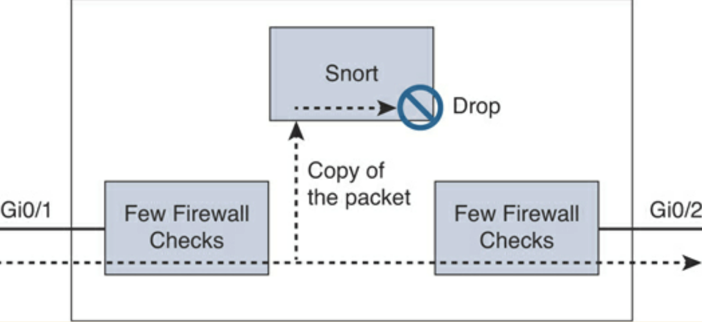

Passive Mode
^^^^^^^^^^^^

* Monitoring/passive mode do not prevent attacks.
* Silently inspects and identifies malicious activity without interrupting the flow of traffic.
* Can operate in either transparent or routed modes.

Example of passive mode:

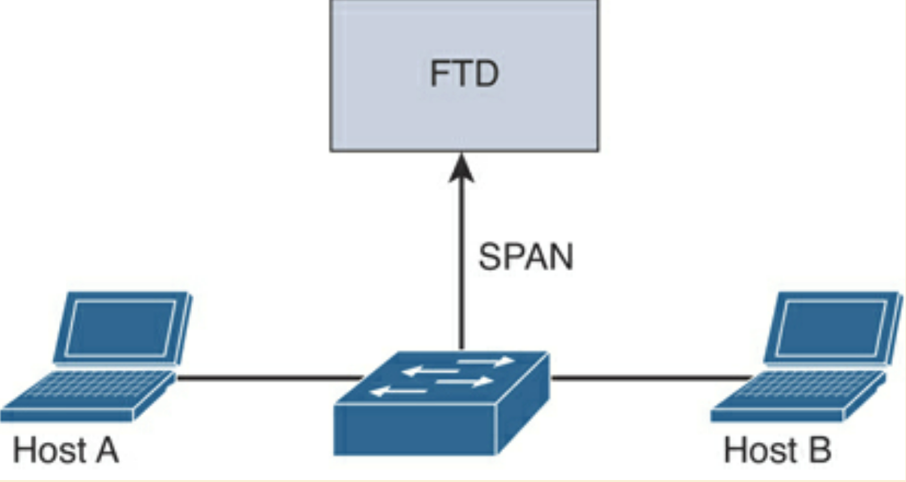

Passive with ERSPAN Mode
^^^^^^^^^^^^^^^^^^^^^^^^

* Similar to remote IDS
* GRE tunnel between capture point and FTD.

Example of ERSPAN passive mode:

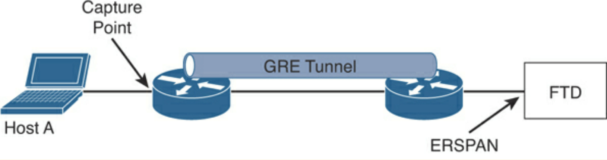

Cisco FTD Deployment Design Configurations
^^^^^^^^^^^^^^^^^^^^^^^^^^^^^^^^^^^^^^^^^^

.. csv-table::
  :header: "Design Consideration", "Recommendation/Comment"
  :widths: 20, 60

  "Management", "Local (FDM), or Central (FMC). FMC recommended for multiple appliances, enhanced visual analysis, central configuration, alerting, and reporting."
  "Standalone or Resilient", "Resilient recommended. Has impact on the number of interfaces required."
  "Link Speed(s)/Types", "Up/downstream speeds, internal/DMZ connections."
  "Routed or Transparent mode", "Routed mode recommended for Edge. Transparent/NGIPS only for customers who already have a third-party firewall."
  "Number of Interfaces", "Internal, External, HA or DMZs."
  "Traffic Profile", "Clear or Encrypted, Streaming, Hosting Services."
  "Application Control", "Typical requirement at the edge. Opportunity to discuss OpenAppID."
  "URL Filtering", "Good for remote/branch locations. Central/HQ may already have provision."
  "Deep Inspection", "Cisco strength. Industry-leading protection. Can have an impact on performance, so size accordingly."
  "File and Malware Protection", "Cisco differentiator. Advanced Malware Protection (AMP) can enhance existing AMP solutions or lead to upsell or further expansion."
