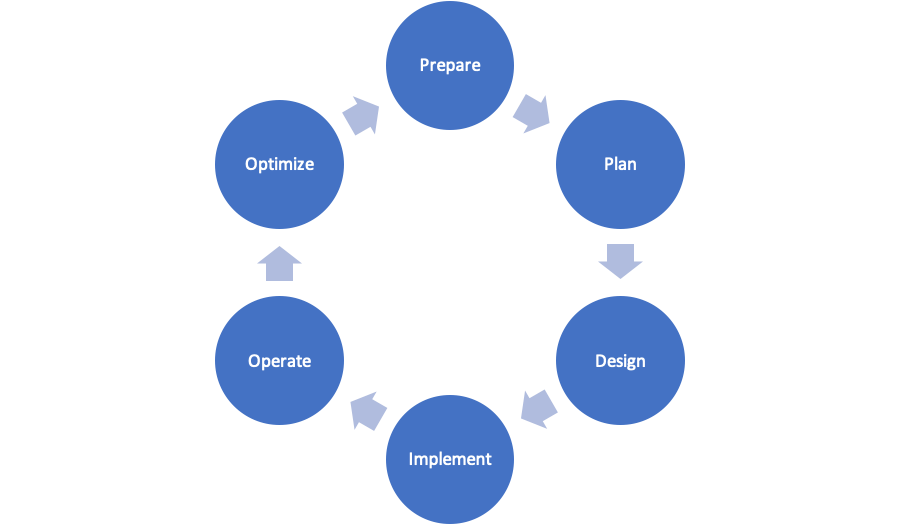

Network Design and Documentation
--------------------------------

Planning: It's Who You Are
^^^^^^^^^^^^^^^^^^^^^^^^^^

* Planning as a personality characteristic
* Find a template that works for you

  * CISCO Network Lifecycle (PPDIOO)
  * Microsoft Project / Excel Template
  * IT Infrastructure Library (ITIL)

* Create the implementation plan
* Follow the implementation plan

Planning: What's Included?
^^^^^^^^^^^^^^^^^^^^^^^^^^

* **Phase 1: Necessary Information/Data**

  * Accurate network diagram
  * Equipment list
  * IP address diagram/spreadsheet
  * Link utilization
  * Configuration commands
  * Timeline
  * Hardware required
  * Relevant contact information

* **Phase 2: Implementation Plan**

  * Identify devices and tasks (checklist)
  * List necessary software version
  * List configurations
  * Verification and testing

* **Phase 3: Documentation**

  * Network diagram/information
  * network equipment
  * Current configurations
  * Known issues
  * Network performance baseline
  * Verification commands and results
  * Monitoring and management utilities
  * Photographs and screen-dumps

**Documentation should be what you are!**

**Documentation is like a deprecating asset!**
