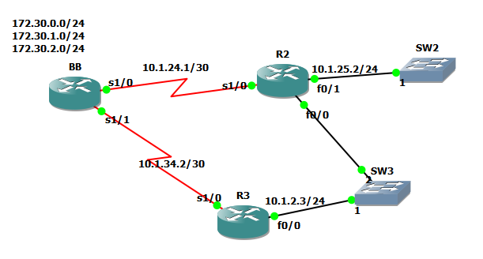
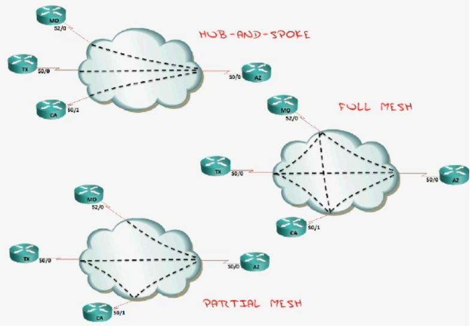
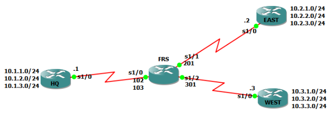

# EIGRP

## Concepts and Planning

### Why You Would Choose to Use EIGRP

1.  Backup routes (Fast convergence / DUAL)
2.  Simple configuration
3.  Flexibility in summarization
4.  Unequal cost load-balancing
5.  combines best of distance vector and link state

### EIGRP Tables and Terminology

**A router running EIGRP maintains three tables:**

-   Neighbour table
-   Topology table (Successor routes, Feasible successor)
-   Routing table

**A router running EIGRP has different terms:**

-   Feasible Distance (FD)
    -   Distance from you to reach a specific route
-   Advertised Distance (AD)
    -   Distance from your neighbour to reach a specific route
-   Successor
-   Feasible Successor
-   Active Route (Bad - actively looking for a backup)
-   Passive Route (Good)

::: note
::: title
Note
:::

To be considered a feasible successor, the AD must be less than the FD
of the successor.
:::

### EIGRP Neighbour Relationships

-   **Hello:** forms relationship
-   **Update:** sends updates
-   **Query:** asks about routes
-   **Reply:** response to a query
-   **Ack:** acknowledges the update, query and reply messages
-   224.0.0.10

### EIGRP Metric Calculation

-   Bandwidth (K1)
-   Delay (K3)
-   Reliability (K4 and K5)
-   Loading (K2)
-   MTU

$$Metric = [(K1*BW+\frac{K2*BW}{256-load}+K3*delay)*\frac{K5}{K4+reliability}]$$

$$Real (default) Metric = [256*(slowestBW+AllLinkDelays)]$$

$$BW = \frac{10^7}{BW}$$

$$Delay = DelayInMicroseconds$$

## Basic Configuration

{.align-center
width="611px" height="328px"}

**BB Router**

``` none
BB#conf t
BB(config)#int s1/0
BB(config-if)#ip add 10.1.24.1 255.255.255.252
BB(config-if)#band 256
BB(config-if)#no shut
BB(config-if)#int s1/1
BB(config-if)#ip add 10.1.34.1 255.255.255.252
BB(config-if)#band 128
BB(config-if)#no shut
BB(config-if)#int lo1
BB(config-if)#ip add 172.30.0.1 255.255.255.0
BB(config-if)#int lo2
BB(config-if)#ip add 172.30.1.1 255.255.255.0
BB(config-if)#int lo3
BB(config-if)#ip add 172.30.2.1 255.255.255.0
BB(config)#router eigrp 90
BB(config-router)#passive-interface default
BB(config-router)#no passive-interface s1/0
BB(config-router)#no passive-interface s1/1
BB(config-router)#variance 2
BB(config-router)#network 10.1.2.1 0.0.0.0
BB(config-router)#network 10.1.24.1 0.0.0.0
BB(config-router)#network 10.1.34.1 0.0.0.0
BB(config-router)#network 172.30.0.0 0.0.3.255
BB(config-router)#network 192.168.1.0 0.0.0.255
BB(config-router)#no auto-summary
BB(config)#ip route 192.168.1.0 255.255.255.0 null0
BB(config)#ip default-network 192.168.1.0
BB#wr
```

**R2 Router**

``` none
R2#conf t
R2(config)#int s1/0
R2(config-if)#ip add 10.1.24.2 255.255.255.252
R2(config-if)#band 256
R2(config-if)#no shut
R2(config-if)#int f0/0
R2(config-if)#ip add 10.1.2.2 255.255.255.0
R2(config-if)#no shut
R2(config-if)#int f0/1
R2(config-if)#ip add 10.1.25.2 255.255.255.0
R2(config-if)#no shut
R2(config-if)#router eigrp 90
R2(config-router)#passive-interface f0/1
R2(config-router)#network 10.1.2.2 0.0.0.0
R2(config-router)#network 10.1.24.2 0.0.0.0
R2(config-router)#no auto-summary
R2#wr
```

**R3 Router**

``` none
R3#conf t
R3(config)#int s1/0
R3(config-if)#ip add 10.1.34.2 255.255.255.252
R3(config-if)#band 128
R3(config-if)#no shut
R3(config-if)#int f0/0
R3(config-if)#ip add 10.1.2.3 255.255.255.0
R3(config-if)#no shut
R3(config-if)#router eigrp 90
R3(config-router)#network 10.1.2.3 0.0.0.0
R3(config-router)#network 10.1.34.2 0.0.0.0
R3(config-router)#no auto
R3#wr
```

## Advanced Configuration

### Frame Relay PVC Design

{.align-center
width="791px" height="551px"}

-   Hub-and-Spoke
    -   Inexpensive
    -   If hub fails, WAN fails
-   Full Mesh
    -   Expensive
    -   Full redundancy
    -   Good for VOIP
    -   Seen in MPLS
-   Partial Mesh
    -   Hybrid
    -   Not so critical spokes have no redundancy

### How EIGRP Handles NBMA (Non Broadcast Multi-Access)

-   EIGRP uses "Pseudo-Broadcasts" or manual neighbours (emulated
    broadcast)
-   Split Horizon can be an issue ("I will not tell somebody what they
    told me")
    -   Disabled on physical interfaces
    -   Enabled on sub-interfaces

### Configuration Example

`_docs/eigrp-advanced-configuration.zip`{.interpreted-text
role="download"}

{.align-center
width="666px" height="228px"}

## Best Practices and Design

### Debugging EIGRP packets

Show communication of EIGRP packets:

`debug eigrp packets`

### Query Swarm Resolutions

1.  Summary routes
2.  Stub configuration

### Configuring Stubs

``` none
R1(config)#router eigrp1
R1(config-router)#eigrp stub
     connected and summary by default, which is recommended (used 99% of time)
     eigrp stub receive-only is the ultimate stub (similar to passive-interface)
```
