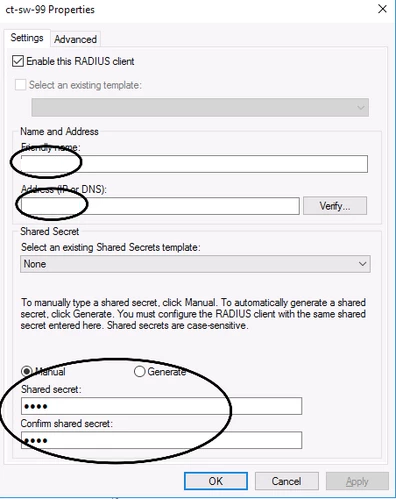
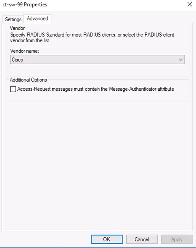

AAA
===

RADIUS
------

You cannot use LDAP on a Cisco switch (at least not this one):

.. code-block:: none

  SW(config)#aaa authentication login default group ?
  WORD     Server-group name
  radius   Use list of all Radius hosts.
  tacacs+  Use list of all Tacacs+ hosts.

The below adds the radius-server to the switch with the secret key "test" and enables authentication via radius, then local

.. code-block:: none

  # enable aaa
  aaa new-model

  # configure the radius server on the switch
  radius-server host x.x.x.x auth-port 1812 acct-port 1813 key test

  # enable radius authentication for the switch
  aaa authentication login default group radius local

  # enable an enable password to become privileged
  enable password mypasswordhere

  # enable vendor specific attributes (optional for basic config, but necessary for advanced features - ISE)
  radius-server vsa send authentication
  radius-server vsa send accounting

  # maintain and build an IP tracking table to track hosts that connect to network (ISE)
  ip device tracking

  # to test authentication
  SW#test aaa group radius caleb.test Password1 new-code
  User successfully authenticated

Via NPS:

Add the client to NPS

