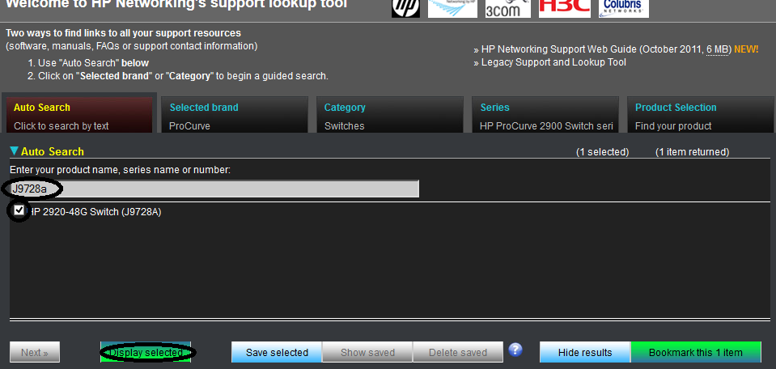
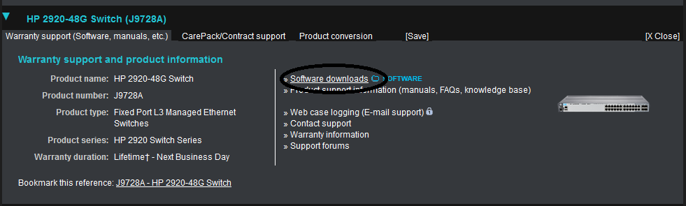
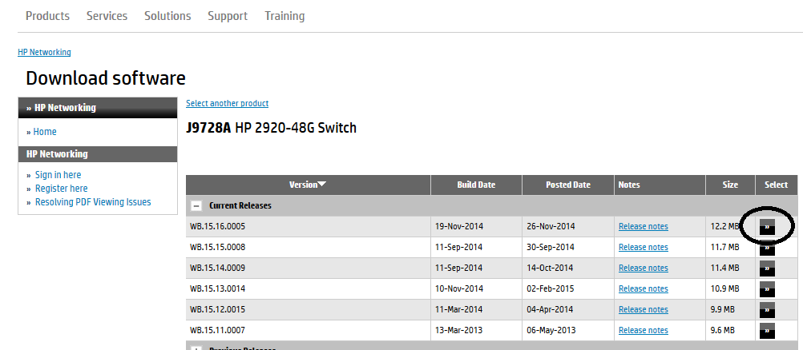
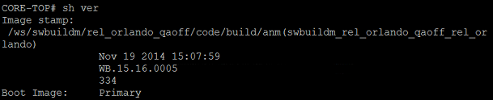

HP Procurve
===========

Checking Health
---------------

Uptime: ``show ver``
Memory: ``show health``
CPU: ``show system processes brief``

Backing up Configs
------------------

Start the TFTP Server.

Run the command ``copy running-config tftp 10.10.0.81 SWITCH-NAME``

Upgrading
---------

1. Go to `HP Support Lookup: <https://h10145.www1.hpe.com/support/SupportLookUp.aspx>`_
2. Find the Model Number of the switch by looking at the front-left side of the switch.

.. image:: _images/hp-procurve-upgrade-1.png

3. Type the model number into the search field on the website, click the checkbox and click Display Selected.

4. Click on Software downloads.

5. Download the latest Current Release.

6. Copy the ``.swi`` file to your TFTP server.
7. Make sure that the TFTP server is running.
8. Remote into the switch.
9. Check the date stamp and version of the flash file currently on the switch by using ``sh ver``.

10. Run the command: ``copy usb flash FILE_NAME primary`` or ``copy tftp 10.10.0.81 FILE_NAME primary``, depending on the source available/method available.
11. Verify that the switch was successfully flashed by checking the version, by using ``show ver`` (shows what version of flash is currently loaded on the switch) and ``show flash`` (shows what the currently booted image is, as well as the Primary and Secondary boot images).

12. Reboot the switch, by pulling out the power cable, if the switches booted flash version is not the same as the Primary flash version.

**A summary of the above:**

.. code-block:: none

  show run
  show version
  show flash
  wr mem
  copy run tftp 10.10.0.81 NAME
  copy tftp flash 10.10.0.81 name.swi primary

  ## it will then say:
  #The Primary OS Image will be deleted, continue [y/n]?

  show flash
  reload

  ## it will then say:
  # System will be rebooted from primary image. Do you want to continue [y/n]?
  # Do you want to save the current configuration [y/n]?

  show version
  show flash

STP Configuration
-----------------

Configuring the Root Bridge:

.. code-block:: none

  Procurve 4204vl-1# configure
  Procurve 4204vl-1(config)# spanning-tree
  Procurve 4204vl-1(config)# spanning-tree priority 0
  Procurve 4204vl-1(config)# write memory

Configuring the other switches:

.. code-block:: none

  Procurve 4204vl-2# configure
  Procurve 4204vl-2(config)# spanning-tree
  Procurve 4204vl-2(config)# write memory

Trunking
--------

.. code-block:: none

  To show trunks:
  Sh trunk

  To show running config:
  Sh run

  To create a trunk:
  Trunk X trkX trunk (where x is a number)

  To create a VLAN:
  Vlan X
  Name Name
  Untag X (makes the default traffic go to this vlan)
  Tag trkX (makes sure that all the ports that are untagged, can travel on the trunk)

  To add port to the wireless:
  Vlan 8
  Untag x
  Tag trk1 (only on new switch)
  Vlan 9
  Tag x
  Tag trk1 (only on new switch)

  To add a port to data network:
  Vlan 2
  Untag x
  Tag trk1 (only on new switch)

  To add an existing port to voice network:
  Vlan 22
  Tag x (where x is the number of the port in data network)
  Tag trk1 (only on new switch)
  Voice (only on new switch)
  Qos dscp 101110 (only on new switch)

  To label port:
  Int x
  Name name
