Mikrotik
========

First Time Setup
----------------

Securing the Router
^^^^^^^^^^^^^^^^^^^

- Disable wireless if not using it
- IP > Services (disable telnet and stuff, only allow certain addresses)

.. code-block:: bash

    ip service print

- System > Password (change the password)
- System > Users > double click on the user and set the allowed addresses

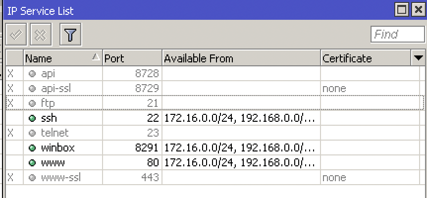

Configuring the Bridge
^^^^^^^^^^^^^^^^^^^^^^

- IP > Addresses (giving the bridge an address that will be used as gateway)

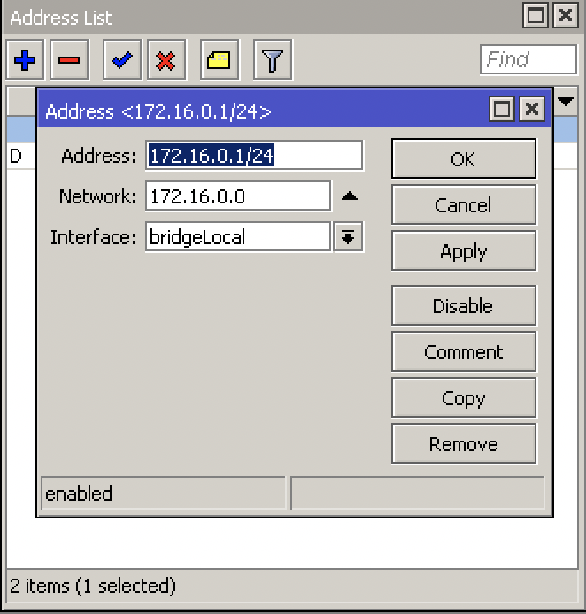

Configuring the Outside Interface
^^^^^^^^^^^^^^^^^^^^^^^^^^^^^^^^^

- Disable ether1 in Bridge
- IP > DHCP Client

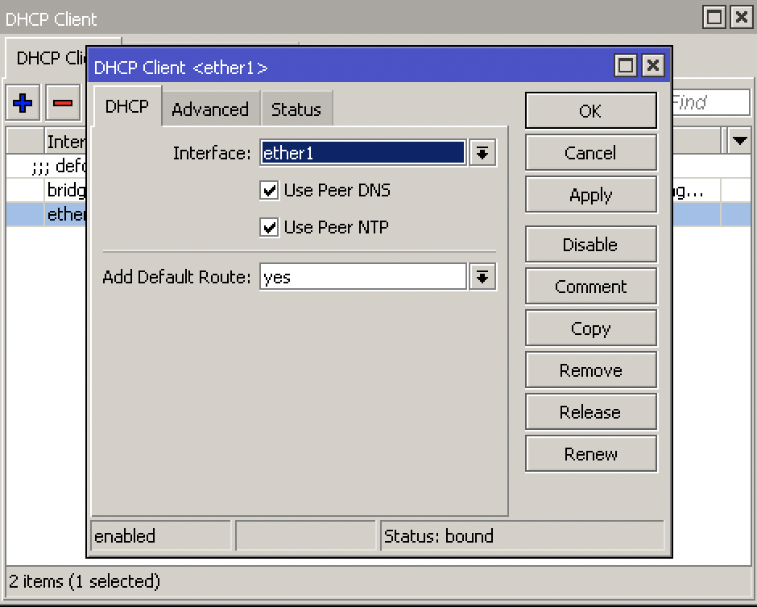

Configuring DHCP Server for Clients
^^^^^^^^^^^^^^^^^^^^^^^^^^^^^^^^^^^

- IP > DHCP Server > DHCP Setup
- DHCP Server Interface: bridgeLocal
- DHCP Address Space: 172.16.0.0/24
- Gateway for DHCP Network > 172.16.0.1
- DHCP Relay > delete this

Configure NAT
^^^^^^^^^^^^^

- IP > Firewall > NAT
- Chain: srcnat
- Action: masquerade

Deny Catch all Firewall Rules
^^^^^^^^^^^^^^^^^^^^^^^^^^^^^

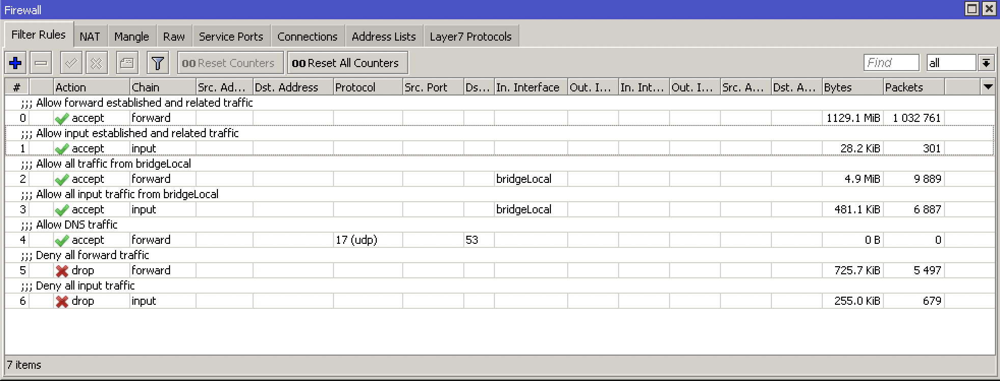

Upgrading the Router
^^^^^^^^^^^^^^^^^^^^

- System > Packages > Check For Updates > Download&install

Upgrading the Firmware
^^^^^^^^^^^^^^^^^^^^^^

- System > RouterBOARD > Upgrade
- System > Reboot

Setting the Identity
^^^^^^^^^^^^^^^^^^^^

* System > Identity

.. code-block:: bash

    system identity set name=Caleb

Users & Groups & SSH Keys
-------------------------

- System > Users (here you can admin all your users nad groups, give read only access, etc.)
- For SSH keys upload your private key file that you generated
- Allow/Deny SSH password Login to disable/enable ssh key login only

.. code-block:: bash

    ip ssh set always-allow-password-login=no
    ip ssh print

HTTPS Access to Router
----------------------

- System > Certificates
- Country: ZA
- Key Size: 2048
- Days Valid: 365
- Key Usage: tls server
- Sign
- IP > Services > enable www-ssl and select the certificate

Backup and Restore
------------------

- Files > Backup

.. code-block:: bash
    
    system backup save encryption=aes-sha256 name=backup
    
    # or (takes a lot of load)
    export
    export file=export

- Files > Restore

.. code-block:: bash

    import file-name=export.rsc

    # or open the file with text editor and copy paste

Resetting Router
----------------

- Press the reset button until the light stops flashing by unplugging the power, holding the button and powering on
- System > Reset Configuration

Netinstall
----------

- Only works on ether1
- Formats the drive, keeps license key and RouterBOOT settings
- Download Netinstall from Mikrotik site and open it
- Click Net booting > boot server enabled > put in IP Address of router

Licensing
---------

- System > License
- https://wiki.mikrotik.com/wiki/Manual:License

DHCP
----

- Discover: broadcast takes place over network
- Offer: the server offers the client a lease
- Request: client requests the lease from the server
- Acknowledge: server sends client ack for the lease

IP > DHCP Server > DHCP Setup

ARP
---

- ARP Request: gets broadcast to find out who the ip address of the mac address is of the ip address
- Server puts the clients mac address and ip address in its arp table and replies to client
- Mikrotik recommends setting your interface arp to reply-only so that it doesnt learn new arps from anywhere else

IP > ARP

Bridging
--------

- Ports in a bridge behave as a switch at layer 2

Bridge

Station Mode
^^^^^^^^^^^^

- Interfaces > wlan1 > mode: station bridge
- Scan and select the WLAN you want to connect to
- this will allow one router to connect to the other one wirelessly: ISP <-> R1 <-> wifi <-> R2 <-> PC

Routing
-------

- Exterior Gateway Protocol (EGP):

    - BGP

- Interior Gateway Protocols (IGP):

    - RIP
    - IGRP (Cisco)
    - EIGRP (Cisco)
    - OSPF
    - IS-IS

IP > Routes

Tunneling / VPN
---------------

What is VPN?
^^^^^^^^^^^^

**Private WAN:**

- Secure
- Confidential
- But expensive

Alternative to private WAN is the internet. However, the internet is unsecure and we need a VPN protocol to run to have a secure data transfer from A to B

**VPN Features:**

- Confidentiality: preventing anyone from reading your data using encryption protocols
- Authentication: verifying that the router/firewall or remote user that is sending VPN traffic is a legitimate device or router
- Integrity: verifying that the VPN packet wasn't changed during transit
- Anty-replay: preventing someone from capturing traffic and resending it, trying to appear as a legitimate device/user

IKEv2 IPSec
^^^^^^^^^^^

- All configuration is done under IP > IPsec

    - Note, according to this Cisco document (https://tools.cisco.com/security/center/resources/next_generation_cryptography), the following algorithms are acceptable:
    - Authentication: sha384 (384 wasnt available in the below example)
    - Encryption: aes-256 cbc
    - Hashing: sha384
    - DH group: modp3084

**Proposal**

Select the auth. Algorithm and encr. Algorithm thats NGE acceptable.

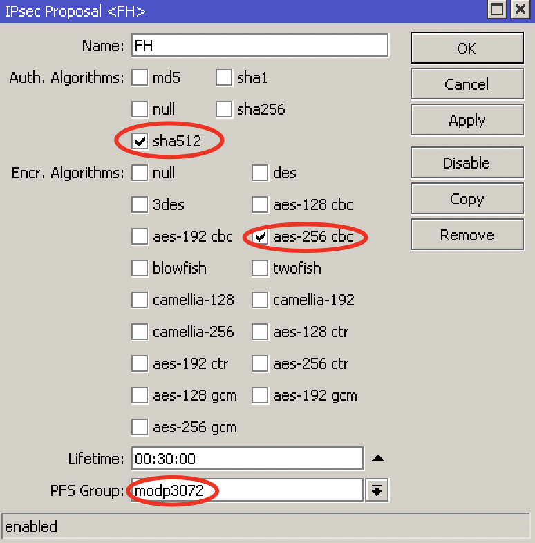

**Profile**

Select the Hash Algorithm, Encryption Algorithm and DH group thats NGE acceptable.

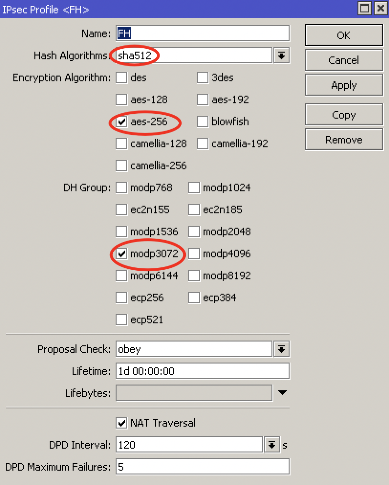

**Peer**

Enter the peer address, select the profile you created and set the exchange mode to IKEv2

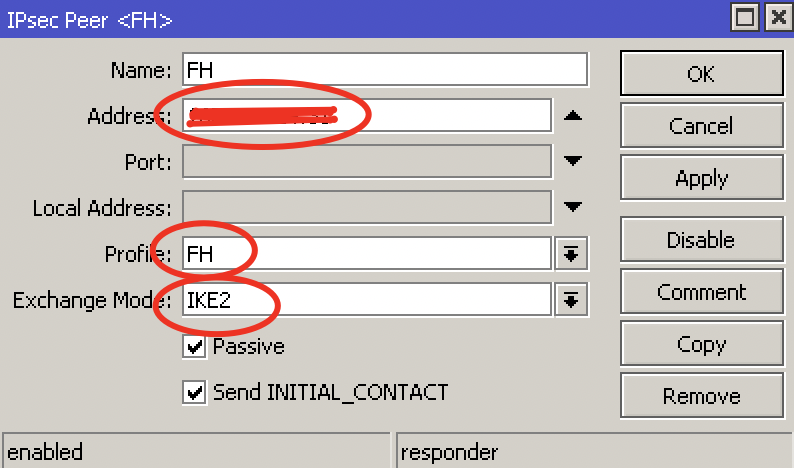

**Identities**

Set a PSK and select the correct peer you created.

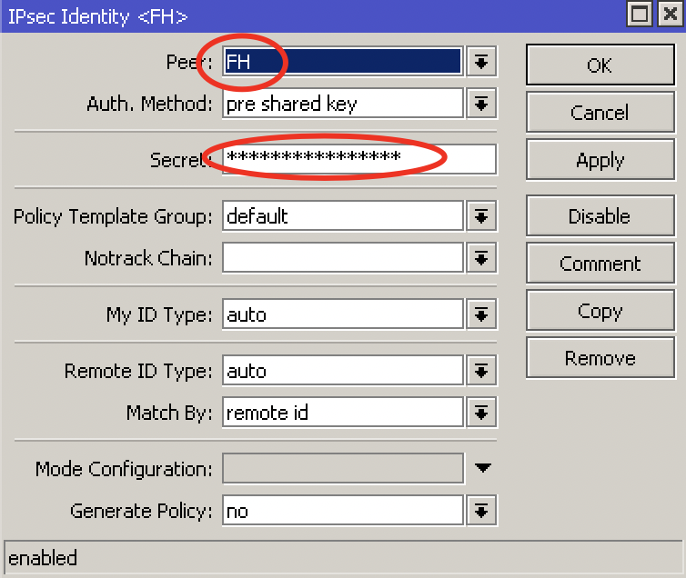

**Policy**

Select the peer you created, set the source and dest addresses, check tunnel.

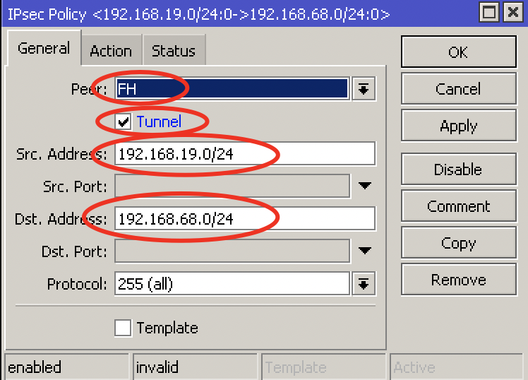

Action encrypt:

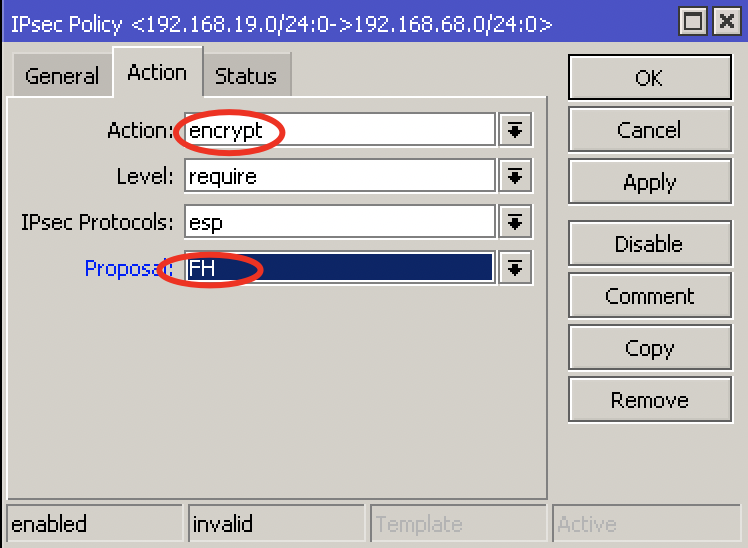

**Firewall & NAT**

Create a srcnat rule with action accept to no-nat the traffic. Put this rule on top.

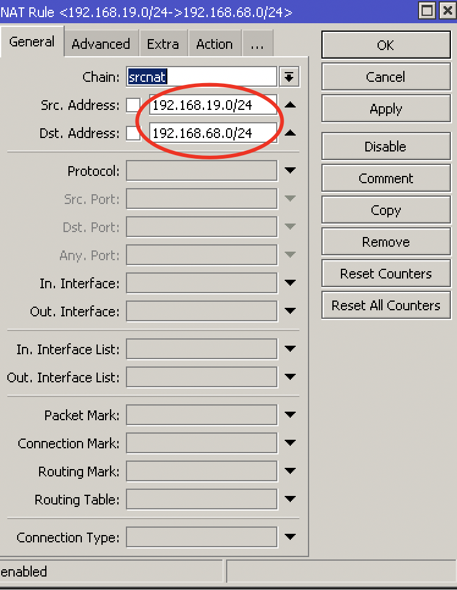

Create a firewall rule to allow the traffic. Action accept, chain forward.

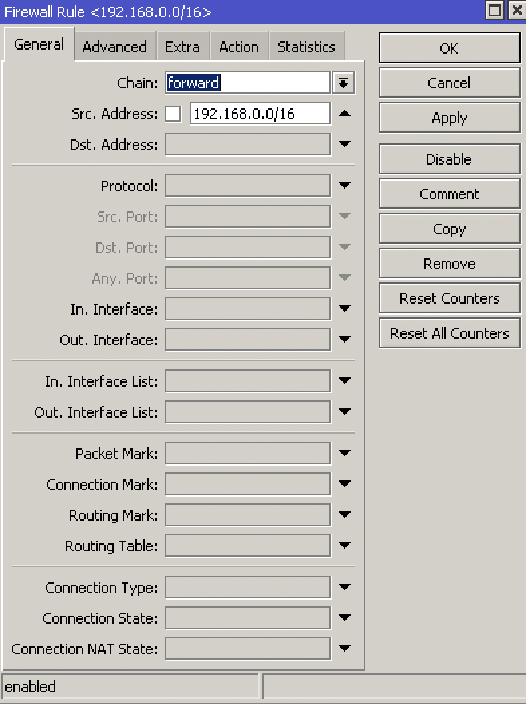

PPTP
^^^^

**What is PPTP:**

- PPTP means Point-to-Point Tunneling Protocol
- PPTP was introduced in 1995
- PPTP is considered a weak VPN protocol in terms of security
- PPTP uses port 1723 to establish a peer connection and uses port 47 (GRE)
- On Mikrotik, PPTP supports site to site and client to site VPN tunneling

**Advantages:**

- Easy configuration
- Very fast VPN protocol
- Available on most platforms

**Disadvantages:**

- PPTP encryption is weak
- A PPTP connection can be exploited by cybercriminals with malicious attacks
- A PPTP connetion can be blocked quite easily by firewalls
- A router with PPTP passthrough is usually required since PPTP doesn't natively work with NAT

**Site to Site Configuration:**

- On the main router:
- PPP > Interface > PPTP Server
- PPP > Secrets > +

    - Name: put a name here
    - Password: put a password here
    - Profile: select the default-encryption profile or a profile you created
    - Local address: the local address of your router
    - Remote address: the local address of the other router

- On the branch router:
- PPP > Interface > + > PPTP Client > Dial Out

    - Connect to: public IP of main router
    - User: the username
    - Password: the password

- Add a route to the local network on each router (IP > Route)

SSTP
^^^^

**What is SSTP:**

- SSTP means Secure Socket Tunneling Protocol
- SSTP is a VPN protocol developed my Microsoft and introduced by them with Windows Vista
- SSTP is considered a safe VPN Protocol
- SSTP uses TCP port 443 - the same port used by HTTPS traiffic
- SSTP can bypass NAT firewalls
- On Mikrotik, SSTP supports site to site and client to site VPN tunneling

**Advantages:**

- SSTP encryption offers a decent level of security
- Easy configuration
- Very difficult to block SSTP because it uses TCP port 443 (same as HTTPS)
- Very stable

**Disadvantages:**

- SSTP protocol clients are available on limited number of platforms (Windows, Android, etc.)
- Possible TCP meltdown problem

**Site to Site Configuration:**

- On the main router:
- PPP > Interface > SSTP Server
- PPP > Secrets > +

    - Name: put a name here
    - Password: put a password here
    - Profile: select the default-encryption profile or a profile you created
    - Local address: the local address of your router
    - Remote address: the local address of the other router

- System > Certificates > +

    - Name: CA-Template
    - Common Name: public IP of the router
    - SAN: IP

- System > Certificates > +

    - Name: Server-Template
    - Common Name: server
    - SAN: IP

- System > Certificates > +

    - Name: Client-Template
    - Common Name: client
    - SAN: IP

.. code-block:: bash

    certificate sign CA-Template ca-crl-host=192.16.12.1 name=myca
    certificate sign Server-Template ca=myca name=server
    certificate sign Client-Template ca=myca name=client
    certicicate set server trusted=yes
    certificate set client trusted=yes
    certificate export-certificate myca export-passphrase=12345678
    certificate export-certificate client export-passphrase=12345678

- PPP > Interface > SSTP Server > Certificate: server

- On the branch router:
- PPP > Interface > + > SSTP Client > Dial Out

    - Connect to: public IP of main router
    - User: the username
    - Password: the password

- System > Certificates > Import > myca.crt
- System > Certificates > Import > myca.key
- System > Certificates > Import > client.crt
- System > Certifiicates > Imports > client.key

- PPP > Interface > SSTP > certificate: client

- Add a route to the local network on each router (IP > Route)

**Client to Site Configuration:**

- PPP > Interface > SSTP Server
- PPP > Secrets > +
- System > Certificates > +

    - Name: CA-Template
    - Common Name: public IP of the router
    - SAN: IP

- System > Certificates > +

    - Name: Server-Template
    - Common Name: server
    - SAN: IP

- System > Certificates > +

    - Name: Client-Template
    - Common Name: client
    - SAN: IP

.. code-block:: bash

    certificate sign CA-Template ca-crl-host=192.16.12.1 name=myca
    certificate sign Server-Template ca=myca name=server
    certificate sign Client-Template ca=myca name=client
    certicicate set server trusted=yes
    certificate set client trusted=yes
    certificate export-certificate myca export-passphrase=12345678
    certificate export-certificate client export-passphrase=12345678

- Import the client and server certificates to the Windows PC into Trusted Root Certification Authorities

PPPoE
^^^^^

- Point-to-point over Ethernet is a layer 2 protocol
- It is often used by ISPs to control access to their networks
- It can be used as a method of access on any layer 2 technology, such as 802.11 or Ethernet
- You cannot reach a PPPoE server through routers. Since its layer 2 protocol, the server can only be reached through the same Ethernet broadcast domain on which the clients are

- IP > Pool
- PPP > Profiles > + > change tcp mss yes
- PPP > Secret
- PPP > PPoE Servers
- On the other router > PPP > PPoE Scan
- On the other router > PPP > Interface > PPPoE client

L2TP Ports and Protocols
^^^^^^^^^^^^^^^^^^^^^^^^

https://serverfault.com/questions/451381/which-ports-for-ipsec-lt2p

- Protocol: UDP, port 500 (for IKE, to manage encryption keys)
- Protocol: UDP, port 4500 (for IPSEC NAT-Traversal mode)
- Protocol: ESP, value 50 (for IPSEC)
- Protocol: AH, value 51 (for IPSEC)

Firewall
--------

Basics
^^^^^^

- Stop unauthorized access
- Block unwanted ports
- Classify and mark connections and packets for QOS or Routing policy

**Firewall functions:**

- Filter packets using filter rules
- NAT: SRCNAT and DSTNAT to translate source and destination addresses
- Mangle: to mark connections and/or packets
- RAW: drop or bypass packets before reaching the connection tracking
- Service ports: using NAT helpers

**Chains:**

- Input = to the router
- Output = from the router
- Forward = via the router

**Firewall Basics:**

- Rules processed in order
- If ... then
- If not matched, then packet is accepted

**Firewall Actions:**

- Passthrough = count packets/bytes
- Drop = discard a packet
- Reject = discard a packet but send ICMP message or TCP reset

    - TCP reset kills a TCP connection instantly

- Tarpit = send ACK flag but dont open the connection

Layer 3 Chains
^^^^^^^^^^^^^^

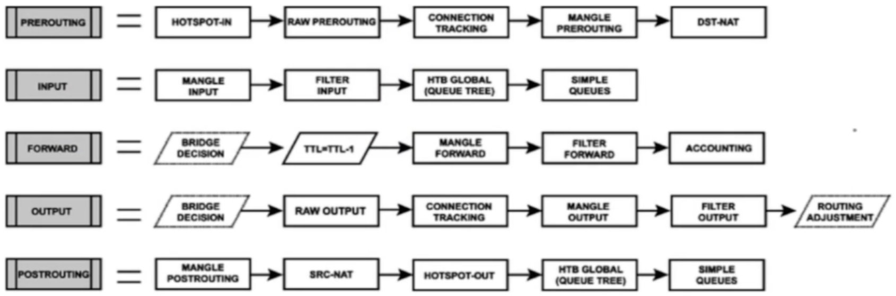

Connection States
^^^^^^^^^^^^^^^^^

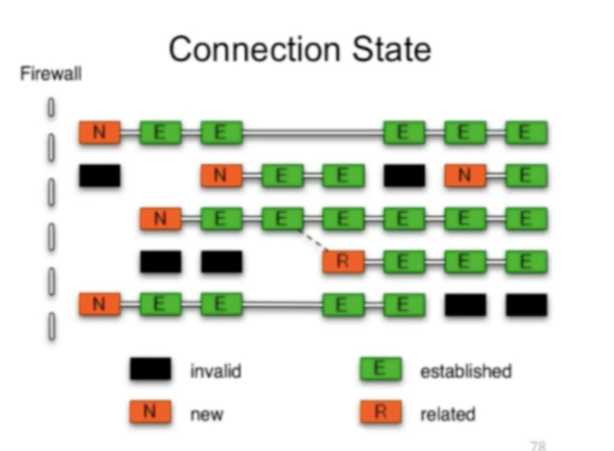

- **New:** The 1st packet observed by the firewall will be new. The firewall will check the packet and if allow then the next packet going to the other direction of that stream will create an established connection
- **Established:** a stream of packetstaht successfully pass both directions of the firewall. Established backets will not be evaluated by the firewall.
- **Related:** they are not considered part of the connection itself but related to it.
- **Invalid:** packets arrived out-of-order to the router or with invalid sequence number. Advise to drop them always.

Rules
^^^^^

- IP > Firewall > +
- Forward rule > Established, Related, accept
- Input rule > Established, Related, accept
- Forward rule > Invalid > drop
- Input rule > Invalid > drop
- Forward rule > allow local lan
- Input rule > local lan accept
- Forward rule > drop anything else
- Input rule > drop anything else

Redirect DNS to Router's DNS
^^^^^^^^^^^^^^^^^^^^^^^^^^^^

- IP > DNS > Allow Remote Requests
- IP > Firewall > dstnat > protocol tcp&udp 53 > action redrirect 53
- IP > DNS > cache

Destination NAT
^^^^^^^^^^^^^^^

- IP > Firewall

    - chain: dstnat
    - Protocol: 6 (tcp)
    - Dst port: 80
    - Action: dst-nat
    - To Address: 172.16.1.254
    - To Ports: 80

FastTrack
^^^^^^^^^

FastTracked packets bypass firewall, connection traffic, simple queues, queue tree with parent=global, ip traffic-flow (restriction removed in 6.33), IP accounting, IPSec, hotspot, universal client, VRF assignment, so it is up to admin to make sure FastTrack doesnt interfere with other config

- Queues > 1M / 1M (on all IPs - so all PCs connected get only 1Mbps)
- IP > Firewall > Mangle

    - Chain: forward
    - Src Address: 192.168.88.2
    - Action: mark connection
    - New Connection Mark: PC-conn

- IP > Firewall > General

    - Chain: forward
    - Connection Mark: pc-conn
    - Action: fasttrack connection

QoS
---

Simple Queue
^^^^^^^^^^^^

- Simple queues limit bandwidth to:

    - client upload
    - client download
    - client aggregate (download and upload)

- Simple queue is applied to a target (mandatory) which can be:

    - An IP Address
    - A network subnet
    - an interface

- Simple queues work in sequence which means that each packet must go through every simple queue until a match occurs
- Destination is where the target's traffic is aimed and it is not compulsory as the target

- Queue > Simple Queue > +
- Tools > Bandwidth Test

Burst
^^^^^

- Burst is important to give extra bandwidth limited time
- Burst Limit = 512K
- Threshold = 192K
- Time = 8s
- First client gets 512Kbps for 3 seconds because:

    - 1 sec = 64K (less than threshold then burst is possible)
    - 2 sec = 128K (less than threshold then burst is possible)
    - 3 sec = 192K (equal to the threshold then burst end)

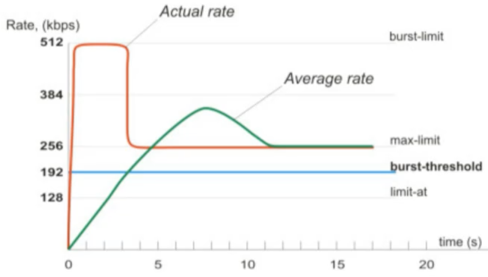

- Queue > Simple queue > General > +

    - Max Limit: 3M
    - Burst Limit: 5M
    - Burst Threshold: 2M
    - Burst time: 10s

Bandwidth limit divided by time. On the first second you'll get 500Kbps extra, etc. until the Burst Limit is reached. Then the speed will go back to normal.

Per Connection Queue (PCQ)
^^^^^^^^^^^^^^^^^^^^^^^^^^

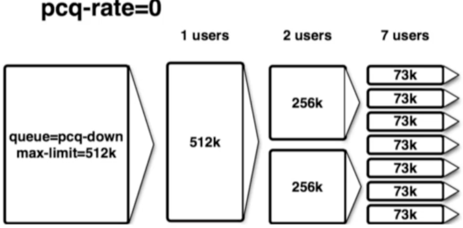

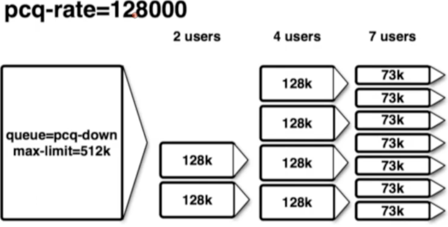

- Queues > Queue Types > copy pcq upload

    - Type Name: PCQ Upload
    - Rate: 0

- Queues > Queue Types > copy pcq download

    - Type Name: PCQ Download
    - Rate: 0

- Queues > General > Simple queue > +

    - Queue Type: PCQ Upload/Download

Tools
-----

Ping
^^^^

- Tools > Ping

Traceroute
^^^^^^^^^^

- Tools > Traceroute

Profile
^^^^^^^

- Tools > Profile

.. code-block:: bash

    tool profile

Emails
------

- Tools > Email

Netwatch
--------

- Tools > Netwatch > +

    - Up: /tool e-mail send to=calebsargeant@gmail.com subject="Router is up" body="Router is up on $[/system clock get time]"
    - Down: /tool e-mail send to=calebsargeant@gmail.com subject="Router is down" body="Router is up on $[/system clock get time]"

Monitoring
----------

Torch
^^^^^

- Tools > Torch

Graphing
^^^^^^^^

- Tools > Graphing > Interface rules
- Tools > Graphing > Resource rules
- http://ip of mikrotik/graphs

The Dude
^^^^^^^^

- Dude > Settings
- Install the dude on your PC
- Open it up and click discover, put in your subnet

Wireless
--------

Terminology
^^^^^^^^^^^

**What is wireless?**

- RouterOS supports various radio modules that allow comminication over the air (2.4GHz and 5GHz)
- MikroTik RouterOS provides a complete support for IEEE 802.11a, 802.11b, 802.11g, 802.11n and 802.11ac wireless networking standards

**Wireless standards**

- IEEE 802.11b - 2.4GHz frequencies, 11Mbps
- IEEE 802.11g - 2.4GHz frequencies, 54Mbps
- IEEE 802.11a - 5GHz frequencies, 54Mbps
- IEEE 802.11n - 2.4GHz - 5GHz 150Mbps (300Mbps)
- IEEE 802.11ac - 5GHz frequencies 1Gbps

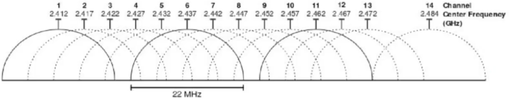

- 802.11b,g frequency range
- Channels 1,6 and 11 non-overlapping

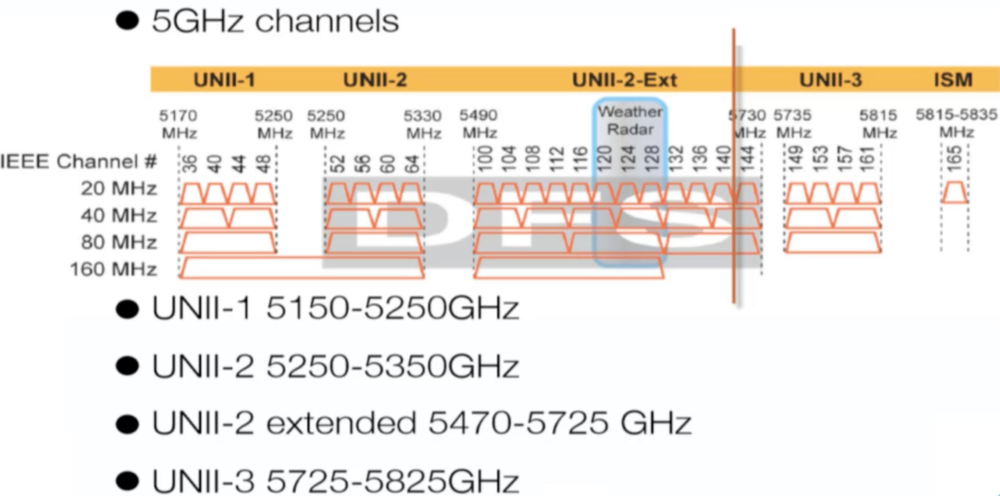

**Supported Frequencies**

Depending on your country regulations wireless card might support

- 2.4GHz: 2312 - 2499 MHz
- 5GHz: 4920 - 6100 MHz

Setup
^^^^^

- Wireless > Security Profiles > +
- Wireless > WiFi Interface > enable and configure, select the Security Profile
- you can use freq usage to check which frequency has little usage
- you can use Snooper to see what's connecting via wifi

Station
^^^^^^^

Make the router a client (nobody connected to that router can get internet)

- Wireless > mode station

Mac Filtering
^^^^^^^^^^^^^

Default Authenticate allows clients to authenticate. Turning it off you must use Wireless > Access list to allow certain clients to access your wifi.

Default forward disabled prevents wifi clients from communicating to each other in the wifi.

