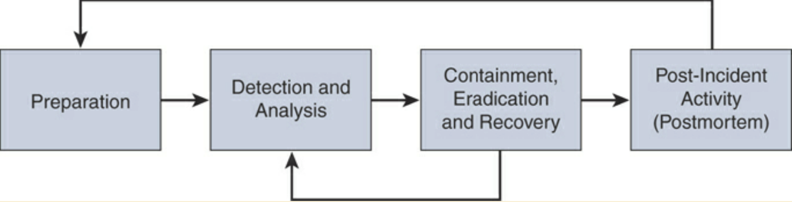

Digital Forensics and Incident Response
=======================================

* Many, many more diverse cybersecurity-related incidences have come about nowadays.
* Disruptive & Damaging, can take down a whole company.
* Must respond quickly to minimise harm & uphold laws.

ISO/IEC 27002:2013 and NIST Incident Response Guidance
------------------------------------------------------

A consistent and effective approach to the management of information security incidents, including communication on security events and weaknesses:

* SP 800-61 Revision 2: “Computer Security Incident Handling Guide”
* SP 800-83: “Guide to Malware Incident Prevention and Handling”
* SP 800-86: “Guide to Integrating Forensic Techniques into Incident Response”

Incidences:

* Drain resources.
* Are expensive.
* Disrupt business from businesses.
* Must be identified before vulnerabilities are exploited.
* Must be avoided by improving security posture.
* Must be avoided via assessment of risk, threat, threat sources, and vulnerabilities.

Risk:

* Can be mitigated or avoided.
* Occurs when people are involved (which is always).
* Cannot be avoided by things out of company's control
* Cannot be avoided by people with malicious intent.
* Can be reduced if we prepare.

Incident preparedness:

* Involves having policies, strategies, plans & procedures.
* Involves companies writing guidelines & documentation, training staff, & "fire" drills.
* Is being ready to act quickly and make swift decisions.

Incident response:

* Is critical.
* Can be complex.
* Involves planning & resources.
* An incident handling guide by NIST: :download:`view here <_docs/NIST.SP.800-61r2.pdf>` / `view online <https://nvlpubs.nist.gov/nistpubs/SpecialPublications/NIST.SP.800-61r2.pdf>`_

Incident response benefits:

* Calm and systematic response
* Minimization of loss or damage
* Protection of affected parties
* Compliance with laws and regulations
* Preservation of evidence
* Integration of lessons learned
* Lower future risk and exposure

Incident Definition
-------------------

A cybersecurity incident is an adverse event that threatens business security and/or disrupts service (loss of CIA). It is not a disaster, which is widespread damage/destruction, loss of life, or drastic change to envirmonment.

Incident examples:

* Exposure or modification of legally protected data
* Unauthorized access to intellectual property
* Disruption of internal/external services.
* Attacker sends a crafted packet to a router and causes a denial-of-service condition.
* Attacker compromises a point-of-sale (POS) system and steals credit card information.
* Attacker compromises a hospital database and steals thousands of health records.
* Ransomware is installed in a critical server and all files are encrypted by the attacker.

Incident management:

* Create organisation-specific definition of *incident*.
* Create a mandatory response process.
* 3rd partys, vendors & business partners, etc. must be contractually obligated to notify organisation when incident occurs.

Events vs Incidents:

* From NIST Special Publication 800-61: “An event is any observable occurrence in a system or network. Events include a user connecting to a file share, a server receiving a request for a web page, a user sending email, and a firewall blocking a connection attempt. Adverse events are events with a negative consequence, such as system crashes, packet floods, unauthorized use of system privileges, unauthorized access to sensitive data, and execution of malware that destroys data.”
* “a computer security incident is a violation or imminent threat of violation of computer security policies, acceptable use policies, or standard security practices.”

False Positives, False Negatives, True Positives, and True Negatives
--------------------------------------------------------------------

* A *false positive* is a situation when security device triggers an alarm, but there is no malicious activity or attack. "Crying wolf"
* A *false negative* is when a device is unable to detect true security events / malicious activity isn't detected by the device.
* A *true positive* is a successful identification of malicious activity.
* A *true negative* is when a device allows the malicious activity.

Evasion techniques against traditional IDS and IPS devices:

* Fragmentation: When the attacker evades the IPS box by sending fragmented packets.
* Using low-bandwidth attacks: When the attacker uses techniques that use low bandwidth or a very small number of packets in order to evade the system.
* Address spoofing/proxying: Using spoofed IP addresses or sources, as well as using intermediary systems such as proxies to evade inspection.
* Pattern change evasion: Attackers may use polymorphic techniques to create unique attack patterns.
* Encryption: Attackers can use encryption to hide their communication and information.

Incident Severity Levels
------------------------

Levels are based upon:

* operational, reputational, and legal impact to the organisation.

Incident Reporting
------------------

* Implement simple mechanisms that all employees can use.
* Employees to report all real & suspected incidents, but not security level.
* People are afraid of being wrong or looking foolish or don't care. Management must encourage.
* People who report incidents (even if false positive) must be praised instead of ridiculed.

Evidence:

* Digital forensic evidence is any information in digital form that can be processed by computing device or stored on other media. This evidence is classified as witness testimony/direct evidence or indirect, such as document, etc.
* Cybersecurity forensic evidence can be contaminated and so the targeted machine can be imaged (physical copy of data, bit for bit) to preserve exploit state. Avoid Electrostatic Discharge (ESD) from damaging evidence.

Chain of custody:

* How evidence is collected
* When it was collected
* How it was transported
* How it was tracked
* How it was stored
* Who had access to the evidence and how it was accessed

Incident Response Program
-------------------------

An IRP contains policies, plans, procedures, and people, which provide well-defined and organised approach for handling incidents and taking action when incidents are traced back to company.

Incident Response Plan
----------------------

NIST Special Publication 800-61 Revision 2 include the following:

* Statement of management commitment
* Purpose and objectives of the incident response policy
* The scope of the incident response policy
* Definition of computer security incidents and related terms
* Organisational structure and definition of roles, responsibilities, and levels of authority
* Prioritisation or severity ratings of incidents
* Performance measures
* Reporting and contact forms

NIST’s incident response plan elements include the following:

* Incident response plan’s mission
* Strategies and goals of the incident response plan
* Senior management approval of the incident response plan
* Organisational approach to incident response
* How the incident response team will communicate with the rest of the organisation and with other organisations
* Metrics for measuring the incident response capability and its effectiveness
* Roadmap for maturing the incident response capability
* How the program fits into the overall organisation

NIST also defines standard operating procedures (SOPs) as “a delineation of the specific technical processes, techniques, checklists, and forms used by the incident response team. SOPs should be reasonably comprehensive and detailed to ensure that the priorities of the organization are reflected in response operations.”

Incident Response Process
-------------------------

Phases of Incident Response Process:

Preparation
^^^^^^^^^^^

* Creating processes for incident handler communications and the facilities that will host the security operation centre (SOC) and incident response team
* Making sure that the organisation has appropriate incident analysis hardware and software as well as incident mitigation software
* Creating risk assessment capabilities within the organisation
* Making sure the organisation has appropriately deployed host security, network security, and malware prevention solutions
* Developing user awareness training

Detection & Analysis
^^^^^^^^^^^^^^^^^^^^

* Profile networks and systems.
* Understand normal behaviours.
* Create a log retention policy.
* Perform event correlation.
* Maintain and use a knowledge base of information.
* Use Internet search engines for research.
* Run packet sniffers to collect additional data.
* Filter the data.
* Seek assistance from others.
* Keep all host clocks synchronised.
* Know the different types of attacks and attack vectors.
* Develop processes and procedures to recognise the signs of an incident.
* Understand the sources of precursors and indicators.
* Create appropriate incident documentation capabilities and processes.
* Create processes to effectively prioritise security incidents.
* Create processes to effectively communicate incident information (internal and external communications).

Containment, Eradication, & Recovery
^^^^^^^^^^^^^^^^^^^^^^^^^^^^^^^^^^^^

* Evidence gathering and handling
* Identifying the attacking hosts
* Choosing a containment strategy to effectively contain and eradicate the attack, as well as to successfully recover from it
* The potential damage to and theft of resources
* The need for evidence preservation
* Service availability (for example, network connectivity as well as services provided to external parties)
* Time and resources needed to implement the strategy
* Effectiveness of the strategy (for example, partial containment or full containment)
* Duration of the solution (for example, emergency workaround to be removed in four hours, temporary workaround to be removed in two weeks, or permanent solution)

Postmortem
^^^^^^^^^^

* Exactly what happened, and at what times?
* How well did the staff and management perform while dealing with the incident?
* Were the documented procedures followed?
* Were they adequate?
* What information was needed sooner?
* Were any steps or actions taken that might have inhibited the recovery?
* What would the staff and management do differently the next time a similar incident occurs?
* How could information sharing with other organisations be improved?
* What corrective actions can prevent similar incidents in the future?
* What precursors or indicators should be watched for in the future to detect similar incidents?
* What additional tools or resources are needed to detect, analyse, and mitigate future incidents?

Simulations and Playbooks
-------------------------

Good for gap analysis of response processes & procedures, create playbooks, which contains:

* Report identification
* Objective statement
* Result analysis
* Data query/code
* Analyst comments/notes

Methodology of Playbooks:

1. Preparation: Identify the audience, what you want to simulate, and how the exercise will take place.
2. Execution: Execute the simulation and record all findings to identify all areas for improvement in your program.
3. Report: Create a report and distribute it to all the respective stakeholders. Narrow your assessment to specific facets of incident response. You can compare the results with the existing incident response plans. You should also measure the coordination among different teams within the organization and/or external to the organization. Provide a good technical analysis and identify gaps.

Information Sharing and Coordination
------------------------------------

Communicate with outside parties regarding incidents:

* law enforcement
* media inquiries
* external expertise
* ISPs
* vendor of hardware & software
* incident response teams
* industry pears

Incident response plan interaction types:

* PR department, legal department, upper management
* avoid leaking sensitive info about incident to unauthorised parties (additional financial loss)
* list contacts & communications of & with external entities for evidence sake

Computer Security Incident Response Teams
-----------------------------------------

* Computer Security Incident Response Team (CSIRT) (/infosec)
* Product security incident response team (PSIRT)
* National CSIRT and computer emergency response team (CERT)
* Coordination center The incident response team of a security vendor
* managed security service provider (MSSP)

Creating a CSIRT:

https://www.cert.org/incident-management/csirt-development/csirt-faq.cfm.

1. Defining the CSIRT constituency

  * Who will be the “customer” of the CSIRT?
  * What is the scope? Will the CSIRT cover only the organization or also entities external to the organization? For example, at Cisco, all internal infrastructure and Cisco’s websites and tools (that is, cisco.com) are the responsibility of the Cisco CSIRT, and any incident or vulnerability concerning a Cisco product or service is the responsibility of the Cisco PSIRT.
  * Will the CSIRT provide support for the complete organization or only for a specific area or segment? For example, an organization may have a CSIRT for traditional infrastructure and IT capabilities and a separate one dedicated to cloud security.
  * Will the CSIRT be responsible for part of the organization or all of it? If external entities will be included, how will they be selected?

2. Ensuring management and executive support
3. Making sure that the proper budget is allocated
4. Deciding where the CSIRT will reside within the organization’s hierarchy
5. Determining whether the team will be central, distributed, or virtual
6. Developing the process and policies for the CSIRT

  * Incident classification and handling
  * Information classification and protection
  * Information dissemination
  * Record retention and destruction
  * Acceptable usage of encryption
  * Engaging and cooperating with external groups (other IRTs, law enforcement, and so on)
  * Hiring policy
  * Using an outsourcing organization to handle incidents
  * Working across multiple legal jurisdictions

Resources for creating a CSIRT:

* ISO/IEC 27001:2005: “Information Technology—Security Techniques—Information Security Management Systems—Requirements”
* ISO/IEC 27002:2005: Information Technology—Security Techniques—Code of Practice for Information Security Management”
* ISO/IEC 27005:2008: “Information Technology—Security techniques—Information Security Risk Management”
* ISO/PAS 22399:2007: “Societal Security—Guidelines for Incident Preparedness and Operational Continuity Management”
* ISO/IEC 27033: Information Technology—Security Techniques—Information Security Incident Management

Product Security Incident Response Teams (PSIRTs)
-------------------------------------------------

https://blogs.cisco.com/security/psirt-services.

The Common Vulnerability Scoring System (CVSS)
----------------------------------------------

* Base, temporal, and environment scores (scoring from 0 [least severe] to 10 [highly critical]).
* Maintained by Forum of Incident Response & Security Teams (FIRST) (https://www.first.org/cvss/v3.1/examples.) (https://www.first.org/cvss).

Vulnerabilities are evaluated by:

* The base group represents the intrinsic characteristics of a vulnerability that are constant over time and do not depend on a user-specific environment. This is the most important information and the only one that’s mandatory to obtain a vulnerability score.
* The temporal group assesses the vulnerability as it changes over time.
* The environmental group represents the characteristics of a vulnerability, taking into account the organizational environment.

Takeaway points:

* Exploits cannot exist without vulnerabilities, but there are not always exploits with vulnerabilities (theoretical vulnerabilities).
* Never deprioritise vulnerabilities because they have not been exploited yet.
* You cannot patch all vulnerabilities. Secure Development Lifecycles (SDL) are vital. https://www.cisco.com/c/en/us/about/security-center/security-programs/secure-development-lifecycle.html

Secure Development Lifecycles
^^^^^^^^^^^^^^^^^^^^^^^^^^^^^

SDLs are “a repeatable and measurable process we’ve designed to increase the resiliency and trustworthiness of our products.” SDLs are the tools & processes designed to accelerate product development methodologies (secure, resilient, & trustworthy systems).:

* Base product security requirements
* Third-party software (TPS) security
* Secure design
* Secure coding
* Secure analysis
* Vulnerability testing

Exploitability Metrics
^^^^^^^^^^^^^^^^^^^^^^

Attack Vector (AV) [level of access an attacker needs]:

* Network (N)
* Adjacent (A)
* Local (L)
* Physical (P)

Attack Complexity (AC) [conditions beyond the attacker’s control]:

* Low (L)
* High (H)

Privileges Required (PR) [level of privileges an attacker must have]:

* None (N)
* Low (L)
* High (H)

User Interaction (UI) [whether UI is needed]

* None (N)
* Required (R)

Scope (S) [impact on systems]:

* Unchanged (U)
* Changed (C)

Impact Metrics
^^^^^^^^^^^^^^

Confidentiality (C) [impact to confidentiality]:

* Low (L)
* Medium (M)
* High (H)

Integrity (I) [impact to integrity]:

* Low (L)
* Medium (M)
* High (H)

Availability (A) [impact to availability]:

* Low (L)
* Medium (M)
* High (H)

Temporal Group Metrics
^^^^^^^^^^^^^^^^^^^^^^

* Exploit Code Maturity (E), which measures whether or not public exploit is available
* Remediation Level (RL), which indicates whether a fix or workaround is available
* Report Confidence (RC), which indicates the degree of confidence in the existence of the vulnerability

Environmental Group Metrics
^^^^^^^^^^^^^^^^^^^^^^^^^^^

* Security Requirements (CR, IR, AR), which indicate the importance of confidentiality, integrity, and availability requirements for the system
* Modified Base Metrics (MAV, MAC, MAPR, MUI, MS, MC, MI, MA), which allow the organization to tweak the base metrics based on specific characteristics of the environment

National CSIRTs and Computer Emergency Response Teams (CERTs)
-------------------------------------------------------------

Examples of teams:

* http://www.cert-in.org.in
* https://cert.gov.au
* https://www.auscert.org.au/
* https://www.first.org/members/teams

“US-CERT’s critical mission activities include:

* Providing cybersecurity protection to Federal civilian executive branch agencies through intrusion detection and prevention capabilities.
* Developing timely and actionable information for distribution to federal departments and agencies; state, local, tribal and territorial (SLTT) governments; critical infrastructure owners and operators; private industry; and international organizations.
* Responding to incidents and analyzing data about emerging cyber threats.
* Collaborating with foreign governments and international entities to enhance the nation’s cybersecurity posture.”

Coordination Centres
--------------------

https://cert.org:

* “CERT Division of the Software Engineering Institute (SEI), we study and solve problems with widespread cybersecurity implications, research security vulnerabilities in software products, contribute to long-term changes in networked systems, and develop cutting-edge information and training to help improve cybersecurity.
* “We are more than a research organization. Working with software vendors, we help resolve software vulnerabilities. We develop tools, products, and methods to help organizations conduct forensic examinations, analyze vulnerabilities, and monitor large-scale networks. We help organizations determine how effective their security-related practices are. And we share our work at conferences; in blogs, webinars, and podcasts; and through our many articles, technical reports, and white papers. We collaborate with high-level government organizations, such as the U.S. Department of Defense and the Department of Homeland Security (DHS); law enforcement, including the FBI; the intelligence community; and many industry organizations.
* “Working together, DHS and the CERT Division meet mutually set goals in areas such as data collection and mining, statistics and trend analysis, computer and network security, incident management, insider threat, software assurance, and more. The results of this work include exercises, courses, and systems that were designed, implemented, and delivered to DHS and its customers as part of the SEI’s mission to transition SEI capabilities to the public and private sectors and improve the practice of cybersecurity.”

Key Incident Management
-----------------------

Incident Management Personnel:

* Incident Response Coordinators (IRC) (verify & log incidents)
* Designated incident handlers
* Incident response team members
* Designated Incident Handeler (DIH) (senior personnel with crisis managemnt & comm skills - incident declaration, liason with execs & managing IRT)

IRT tasks:

* Overall management of the incident
* Triage and impact analysis to determine the extent of the situation
* Development and implementation of containment and eradication strategies
* Compliance with government and/or other regulations
* Communication and follow-up with affected parties and/or individuals
* Communication and follow-up with other external parties, including the board of directors, business partners, government regulators (including federal, state, and other administrators), law enforcement, representatives of the media, and so on, as needed
* Root cause analysis and lessons learned
* Revision of policies/procedures necessary to prevent any recurrence of the incident
