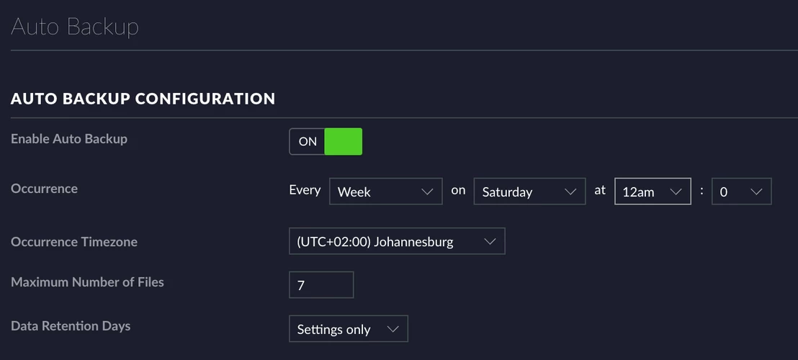

Ubiquiti UniFi
==============

It's a pretty self-explanatory system, but anyway, here's some stuff on it.

Access Point
------------

Cisco Switchport Config
^^^^^^^^^^^^^^^^^^^^^^^

Below shows UAP config for switchport, where 10 is the VLAN the AP natively lives in, 20 & 30 being WLANs.

.. code-block:: none

  interface GigabitEthernet0/5
  description UAP
  switchport trunk encapsulation dot1q
  switchport trunk native vlan 10
  switchport trunk allowed vlan 10,20,30
  switchport mode trunk

Controller
----------

Installation
^^^^^^^^^^^^

Refer to this guide: https://help.ubnt.com/hc/en-us/articles/220066768-UniFi-How-to-Install-Update-via-APT-on-Debian-or-Ubuntu

Backups
^^^^^^^

**Manual Backups**

To manually backup the controller, go to *Settings > Maintenance > Backup*. Set the *Backup Data Retention* and click on *Download Backup*. Manually copy the backup to <LOCATION>.

**Auto Backups**

Restoring
^^^^^^^^^
To restore the controller from a file, go to *Settings > Maintenance > Restore*. Click on *Choose File* and select the file to restore.

Windows Credential Recovery
^^^^^^^^^^^^^^^^^^^^^^^^^^^

1. Open Ubiquiti UniFi Controller.
2. Download mongoDB. https://www.mongodb.com/download-center
3. Open CMD
4. ``cd %userprofile%\downloads\mongo..\bin``
5. ``/mongo --port 27117``
6. ``use ace``
7. ``db.admin.find()``

The username and password will be at the bottom
