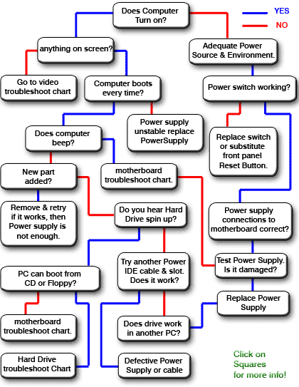

Hardware Troubleshooting
========================

This is all sourced from http://www.fixingmycomputer.com and placed in this documentation, as *fixingmycomputer* may not be online forever, being mostly Windows XP orientated...

Boot
----

Hard Drive
----------

.. image:: _images/hardware-troubleshooting-hd-repair-chart.gif

Motherboard
-----------

Graphics Card
-------------

.. image:: _images/hardware-troubleshooting-video-flowchart.gif
